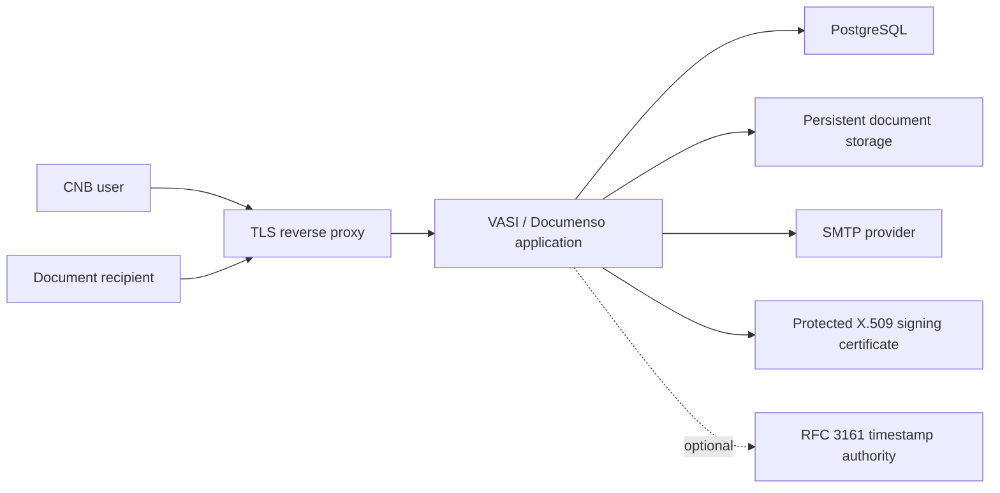

# Architecture Direction

VASI will use the selected Documenso Community Edition release as its
application baseline and add the smallest practical CNB-specific layer.

## Design Principles

- Keep upstream source layout and behavior recognizable.
- Prefer supported configuration and replaceable brand assets over deep forks.
- Keep PostgreSQL, signing material, and other internal services off the public
  network.
- Persist databases and documents outside ephemeral container layers.
- Terminate TLS at a managed reverse proxy and forward only required traffic.
- Store production secrets outside images and tracked Compose files.
- Pin the upstream version and container image digest used for every release.
- Make backups, restore tests, upgrades, rollback, and certificate rotation part
  of the design rather than afterthoughts.

## Repository Integration Shape

The exact source integration shape is intentionally deferred until the upstream
baseline task. The default is to preserve Documenso's monorepo at the repository
root, keep its lockfiles and tooling, and add VASI-specific assets and operations
in clearly documented paths. Any alternative must explain how upstream security
and maintenance releases will be merged.

## Trust Boundaries

- Public: reverse-proxy HTTPS endpoints required by users and recipients.
- Application-private: application-to-database, storage, mail, job, and other
  supporting-service traffic.
- Secret: encryption keys, database credentials, SMTP credentials, signing
  certificate/private key/password, timestamp credentials, and session secrets.
- Sensitive data: source documents, completed PDFs, signatures, recipient
  identity, audit events, IP addresses, delivery metadata, and backups.
