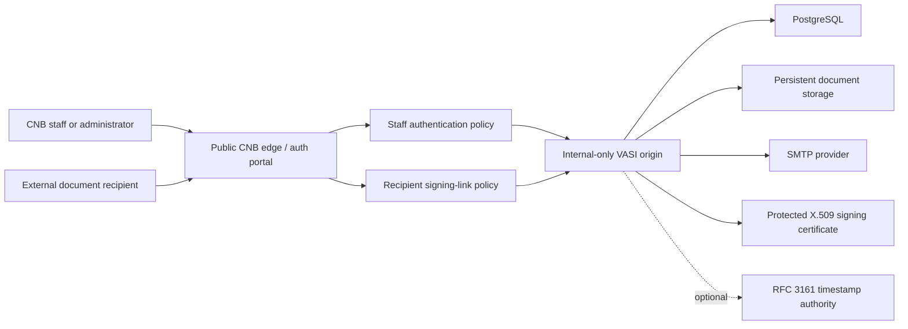

# Architecture Direction

VASI will use the selected Documenso Community Edition release as its
application baseline and add the smallest practical CNB-specific layer.

## Edge And Origin Model

The preferred architecture exposes only the CNB edge/auth gateway to the WAN.
The VASI/Documenso application is an internal origin reachable from that edge
over an approved private route. A separate public origin hostname is not needed
for normal signing when the edge proxies the required application routes.

The edge has two distinct human access policies:

- Staff and administrators authenticate through the CNB portal before reaching
  VASI management/application routes.
- External recipients follow unique signing invitations through the same
  public edge, but must not need a CNB staff account. Those routes preserve the
  upstream recipient token plus any configured email verification, access code,
  passkey, or account requirement.

API, webhook, callback, health, static-asset, and background-job paths require
their own explicit route inventory after the upstream baseline is selected.
Nothing should be exposed merely because it exists upstream.

The selected baseline's concrete allowlist and deny rules are recorded in the
[edge route and exposure policy](operator/edge-route-policy.md). It treats
recipient and staff TRPC calls separately even though the upstream application
mounts both under one URL prefix.

## Design Principles

- Keep upstream source layout and behavior recognizable.
- Prefer supported configuration and replaceable brand assets over deep forks.
- Keep PostgreSQL, signing material, and other internal services off the public
  network.
- Bind the VASI origin to a private interface/network and allow application
  ingress only from the edge plus approved management sources.
- Persist databases and documents outside ephemeral container layers.
- Terminate public TLS at the edge and protect the private edge-to-origin hop
  with TLS or mTLS when practical.
- Configure VASI's canonical public URL as the edge URL so generated emails,
  redirects, cookies, and links never expose the internal origin.
- Preserve the original client address and scheme through standard forwarding
  headers, and trust those headers only from the known edge.
- Store production secrets outside images and tracked Compose files.
- Pin the upstream version and container image digest used for every release.
- Make backups, restore tests, upgrades, rollback, and certificate rotation part
  of the design rather than afterthoughts.

## Repository Integration Shape

The Documenso monorepo is preserved at the repository root with its lockfiles
and tooling. VASI-specific configuration lives under `ops/config/`, public
operator guidance under `docs/operator/`, and narrow startup checks under the
existing application/library packages. This keeps downstream changes visible
while preserving a practical path for upstream security merges.

## Trust Boundaries

- Public: edge HTTPS endpoints required by staff and recipients.
- Edge policy: CNB staff authentication, recipient-link routing, rate limiting,
  request limits, forwarded-header normalization, and public route allowlists.
- Internal origin: VASI application ingress accepted only from the edge and
  approved private management sources.
- Application-private: application-to-database, storage, mail, job, and other
  supporting-service traffic.
- Secret: encryption keys, database credentials, mail-provider credentials, signing
  certificate/private key/password, timestamp credentials, and session secrets.
- Sensitive data: source documents, completed PDFs, signatures, recipient
  identity, audit events, IP addresses, delivery metadata, and backups.
