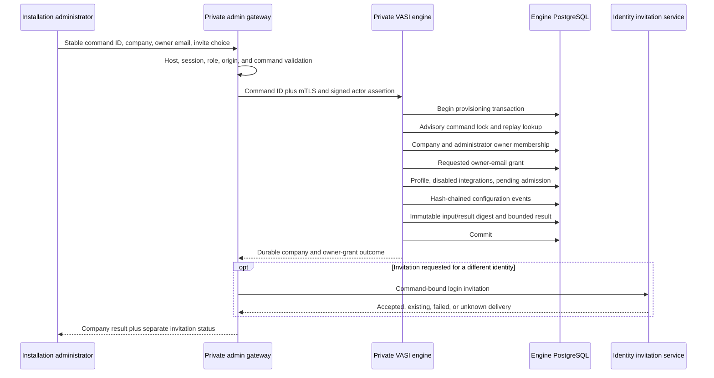

# Company provisioning and owner handoff

Status: implemented in VASI 0.27.0 and replay-hardened in VASI 0.28.0.

## Purpose and boundary

First-company creation is an installation-administrator operation on the
private admin origin. The public login origin does not expose provisioning, and
the private VASI engine remains unreachable from participant networks. The
gateway authenticates and authorizes the administrator, validates a strict
bounded command, and translates the session into the existing short-lived
actor assertion.

The supported command contains only:

- an opaque UUID provisioning command identifier;
- a normalized company name;
- a lowercase stable identifier;
- the verified-email address to receive the initial `owner` grant; and
- an explicit choice whether to send a V·Sign login invitation.

Unknown fields, an invalid or missing command UUID, unsafe control characters,
malformed identifiers, invalid email domains, missing invitation choice, wrong
admin host, missing session, non-administrator role, and invalid mutation
origin fail before provisioning.

## Durable engine transaction

The engine either commits every company-bound record or rolls the transaction
back. The creating administrator receives an engine-owned tenant `owner`
membership so the company can be configured. When the requested owner email is
different, the same transaction creates an active owner grant. On that user's
next authenticated company listing, the engine claims the grant against the
stable identity principal. An identity `admin` role never grants implicit
cross-tenant workflow or evidence access.

Every new company starts with disabled notification and malware-scanning
bindings and a pending production-admission revision. Provisioning permits
configuration work only. Request issuance and active outbound integration
bindings remain blocked until all eight assurance gates are approved.

## Replay and integrity contract

The browser generates a cryptographically random UUID and reuses it only while
the normalized company name, identifier, owner email, and invitation choice
remain unchanged. A successful response clears it. A network or server failure
retains it, allowing the operator to retry without first deciding whether the
private transaction committed.

Inside the engine transaction, a PostgreSQL advisory lock serializes all uses
of that command. The engine hashes the normalized provisioning input together
with the administrator principal and normalized actor email. The replay row
stores the command UUID, principal, input digest, exact bounded result, and
result digest; it does not store a plaintext copy of the command. The row is
immutable. Same-principal, same-input reuse returns the integrity-validated
committed result before quota or tenant writes. Changed-input or
cross-principal reuse returns a bounded conflict. A result with a damaged hash,
unexpected fields, mismatched owner/profile/admission binding, or invalid
generated identity fails closed.

The command index is installation control-plane state, has no `tenantId`, and
is explicitly excluded from tenant export/import. Legacy direct engine clients
that omit a command ID remain compatible, but the supported gateway route
requires one.

## Invitation outcome and recovery

Identity invitation delivery occurs after the engine commit because the
identity and engine databases are intentionally separate authorities and email
cannot participate in the engine PostgreSQL transaction. The invitation row is
bound to the provisioning command before provider contact. Its delivery state
moves only from `pending` to `provider_accepted` or `failed`; the command,
recipient, inviter, token digest, and expiration binding are immutable. The
response uses one of six bounded outcomes:

| Outcome | Meaning | Operator action |
| --- | --- | --- |
| `sent` | The durable owner grant exists and the provider accepted the seven-day login invitation | Wait for owner sign-in |
| `existing_account` | The owner already has a V·Sign account | Ask the owner to sign in; the engine claims the grant |
| `not_required` | The creating administrator is the requested owner | Continue in the company control plane |
| `skipped` | The operator explicitly declined invitation delivery | Share the approved login path separately |
| `delivery_failed` | The company and owner grant committed, but invitation delivery failed | Do not recreate the company; retry only the identity invitation |
| `delivery_unknown` | Provider acceptance or the durable delivery receipt could not be distinguished safely | Confirm with the owner; do not recreate the company; use a new manual invitation only if needed |

Provider acceptance or SMTP success still does not prove inbox delivery,
receipt, reading, identity, or attention. Invitation tokens remain single-use,
expire after seven days, and are stored only as SHA-256 digests. A failed
delivery revokes its invitation record and produces the existing value-free
administrator audit event. Exact command replay returns a confirmed accepted
invitation without provider contact. A `pending` replay never sends again
automatically: a process can fail after a provider accepts mail but before the
receipt transaction commits, and no local protocol can distinguish that case
from failure immediately before provider contact. VASI reports that uncertainty
rather than risking duplicate delivery.

## User interfaces and compatibility

The main internal `/admin` console presents company provisioning before the
assurance-gate panel. After success it refreshes the admission list, labels the
company production-pending, and links the authorized administrator to the
company control plane. Mail failure or uncertainty is displayed as a
recoverable partial success rather than a failed tenant transaction.

The `/admin/evidence` first-slice screen remains available for compatibility,
but it now collects the initial owner email and delegates creation to the same
supported route. Deployment and health verification never create a real
company; a named pilot owner and approved admission evidence are required
before production work begins.
