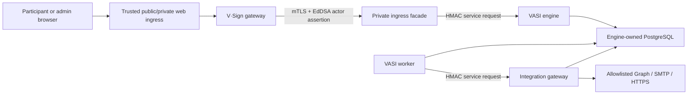

# Private VASI engine boundary

Status: accepted and implemented as the service foundation in VASI 0.4.0.

## Decision

The evidence engine is an independently deployable private service. Public
browsers, authentication providers, customer integrations, and public reverse
proxies never connect to the engine container. V·Sign is the participant
gateway and translates an authenticated session into a narrow internal actor
assertion. Owner actions use the same bounded service contract, while outbound
delivery crosses a separate worker-to-integration-gateway contract.

Only the private-ingress facade may have a host listener. The sanitized
contract binds it to loopback. A live deployment may bind it to an explicitly
approved private address, but the engine, worker, and integration gateway still
have no published ports. The engine-facing Docker networks are internal.

## Layered service and actor trust

The gateway-to-facade connection requires TLS 1.3, server-certificate
verification, and a client certificate issued by the configured service CA.
The facade additionally pins the expected client-certificate SHA-256
fingerprint. Browser cookies, provider tokens, OAuth codes, and passwords are
never sent to the facade or engine.

The facade creates a new internal request ID and signs the exact method, path,
timestamp, body digest, and service ID with HMAC-SHA-256. The engine accepts a
30-second window, compares the signature in constant time, rejects duplicate
request IDs, and authorizes the service identity to an explicit action.

Actor operations also require a one-minute EdDSA JWT. Its contract includes:

- issuer, audience, subject, key ID, unique assertion ID, and bounded times;
- the stable VASI principal and gateway-session IDs;
- roles and optional tenant context; and
- the available authentication method and provider context.

The engine validates signature, issuer, audience, algorithm, lifetime, and
claim shape. Assertion IDs are inserted into an engine-owned PostgreSQL replay
table; reuse is rejected even through a newly signed service request.

## Ownership and dependency rules

- `packages/engine-contracts` owns versioned actor-assertion validation.
- `packages/engine-domain` owns service/action authorization.
- `packages/engine-crypto` owns deterministic internal request signing.
- `packages/engine-client` owns the framework-neutral gateway client proof.
- `services/engine` owns engine transport and persistence access.
- `services/private-ingress` owns mTLS termination and the narrow route map.
- `services/worker` owns durable background processing.
- `services/integration-gateway` owns credential use and bounded outbound
  adapter execution.

The engine/domain packages do not import Next.js, Better Auth, provider SDKs,
SMTP libraries, or customer code. Optional provider protocols are confined to
the integration-gateway adapter layer; Microsoft Graph uses fixed HTTPS
endpoints and no provider SDK, while document scanning uses a strict signed
HTTPS byte/verdict contract. The admin-only gateway diagnostic is an adapter
around the same contracts, not an engine dependency on the gateway.

The portable baseline uses PostgreSQL and built-in Node cryptography/networking
plus JOSE. It requires no proprietary identity broker, queue, workflow engine,
secret manager, or hosted service. Alternate key custody and queue adapters may
be added without changing the domain contracts.

## Persistence boundary

The engine uses a dedicated PostgreSQL database where possible. At minimum it
must use a dedicated login role, schema, migration history, and bootstrap; the
gateway never queries engine tables. Version 0.4.0 creates the private
`vasi_engine` schema, persistent actor-assertion replay table, and PostgreSQL
outbox-job baseline. Versions 0.5.0 and 0.6.0 add the evidence transaction and
workflow/control-plane domain tables through engine-only migrations.

Engine runtime configuration uses the `engine` settings scope. The gateway's
client certificate/key and assertion private key use the `gateway` scope. Every
value remains encrypted and bound to its installation, scope, and name.

## Current limits

This boundary proves authenticated service identity, actor context, replay
defense, process isolation, database ownership, and deployment posture. VASI
0.5.0 adds the separately documented first sealed terms/response slice, VASI
0.6.0 adds the general workflow and company control plane, VASI 0.7.0 adds
PostgreSQL document artifacts and rich electronic activities, VASI 0.8.0 adds
separately documented provider-hosted media and duration evidence, and VASI
0.9.0 adds PostgreSQL-backed evidence reports, bundles, and fingerprint
verification. VASI 0.10.0 adds engine-owned retention revisions, lifecycle
chains, legal holds, sealed purge tombstones, participant history, and reviewed
data exports. VASI 0.11.0 adds revisioned installation/tenant policy and the
separate allowlisted integration gateway, and VASI 0.13.0 adds its governed
Microsoft Graph mail adapter. Higher-assurance external trust adapters remain
later milestones. VASI 0.14.0 adds an administrator-only, aggregate operational
snapshot across this same service/actor boundary; it exposes health counts and
ages but no customer identity, request, content, response, link, payload, or
credential data. VASI 0.19.0 adds the governed digest-bound document scanner
through the same isolated gateway and extends the aggregate snapshot with
scanner failure/threat/retry counts.
