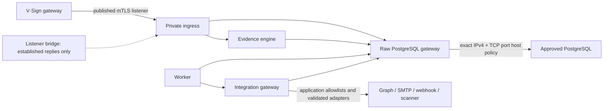

# Private-engine outbound isolation

Status: accepted in VASI 0.21.0; listener publication control completed in
VASI 0.21.2.

## Decision

Private VASI processes are deny-by-default for outbound network access. The
engine and worker join only Docker networks marked internal. Private ingress
joins those same internal application/data networks plus a dedicated listener
bridge required for Docker host-port publication; an exact host chain rejects
all new forwarded traffic sourced from that bridge while allowing established
replies. The integration gateway alone joins a dedicated provider-egress
network. A minimal PostgreSQL transport gateway is the only persistent process
on a separate database-egress network.

`engine-data`, `engine-private`, and `engine-integrations` are internal. Only
`database-gateway` joins `database-egress`; one-shot initialization,
migration, backup, capacity, and policy tools may join it while they run. Only
`integration-gateway` joins `integration-egress`. Private ingress alone joins
`private-ingress-listener`, whose stable subnet is covered by the second host
chain. No service receives host networking, the Docker socket, `NET_ADMIN`, or
a firewall capability.

## PostgreSQL identity and transport

The persistent clients retain the original PostgreSQL URL and TLS settings.
A fixed, tracked, non-secret marker tells the Node PostgreSQL client to open
its raw socket to `database-gateway:5432`; TLS still starts end-to-end in the
client and validates the original database hostname. The transport gateway
does not terminate TLS, parse PostgreSQL, know credentials, or select an
arbitrary destination. It reads only the protected bootstrap destination and
pool bound, resolves at most 16 safe IPv4 answers, relays bytes to the fixed
port, and limits concurrent and incomplete connections.

The current host adapter uses Linux `iptables` through
[Docker's documented `DOCKER-USER` forwarding boundary](https://docs.docker.com/engine/network/firewall-iptables/).
Its policy semantics are independent of the
adapter: allow established return traffic, traffic within the dedicated
bridge, and TCP from that bridge to the resolved PostgreSQL IPv4 address set
and configured port; reject every other forwarded packet from the bridge. The
renderer never includes the hostname, URL, database name, or credentials.
With `--format portable-json`, it returns the same bounded source subnet,
destination IPv4/port set, protocol, established/intra-bridge allowances, and
default-deny decision as `vasi-database-egress-policy/v1`. That root-only
output is the adapter boundary for nftables, a cloud firewall, or another
approved host control; the packaged applicator consumes the default `iptables`
form.

Every engine bridge has IPv6 disabled and one stable reviewed `/28` allocation
inside the sanitized `172.29.254.0/24` reservation. Exact assignment is:

| Network | Sanitized subnet |
| --- | --- |
| `database-egress` | `172.29.254.0/28` |
| `private-ingress-listener` | `172.29.254.16/28` |
| `engine-private` | `172.29.254.32/28` |
| `engine-data` | `172.29.254.48/28` |
| `engine-integrations` | `172.29.254.64/28` |
| `integration-egress` | `172.29.254.80/28` |

Fixing every allocation prevents Docker's dynamic `/16` allocator from
claiming the firewall subnets first when only part of the stack is created. An
installation with an overlapping route must select six distinct, stable,
private IPv4 subnets as one ignored Compose override and preserve the same
single-subnet and IPv6-disabled invariants. IPv6-only PostgreSQL is deliberately
unsupported by this adapter and fails closed.

The listener bridge uses its separate allocation with the facade's
default-gateway priority set explicitly. Docker
[bridge publication](https://docs.docker.com/engine/network/port-publishing/)
depends on a non-internal network; therefore network metadata alone is not the
egress control. The
`VASI_INGRESS_EGRESS` host chain allows only established/related packets sourced
from that subnet and rejects every other forwarded packet from it. This keeps
inbound mTLS replies available without permitting the facade to originate a
public connection. The applicator validates and installs the database and
listener policies together.

## Persistence and ordering

The packaged policy service runs after Docker and network availability. Its
timer reapplies the policy after boot and every two minutes, covering Docker
network recreation and bounded DNS changes. The transport gateway refreshes
its IPv4 set every minute and becomes unhealthy after five minutes without a
successful resolution. If DNS changes between refreshes, a new address can be
denied until the host policy catches up; availability may pause, but the
policy does not broaden.

The policy must be applied before persistent services start. A deployment
manager should order the VASI engine stack after
`vasi-engine-database-egress-policy.service`. The one-shot bootstrap
initializer is the only fresh-install exception because the protected
database destination does not exist until initialization completes; apply the
policy immediately afterward and before migration or service startup.

The shipped systemd units assume `/opt/vasi-engine/current`. Change
`WorkingDirectory` and the matching documentation path when an installation
uses a different release symlink. If that path is below `/home`, the installed
units also need `ProtectHome=read-only` and `CAP_DAC_READ_SEARCH` added to their
`CapabilityBoundingSet` so the root one-shots can traverse a mode-0700 release
parent without making it writable. Verify both installed units with
`systemd-analyze verify` and successful manual runs before enabling their
timers. Unit configuration contains no secret or environment file. The root
host service's capabilities are not passed to any container.

The default Docker project and firewall chains are `vasi-engine`,
`VASI_DATABASE_EGRESS`, and `VASI_INGRESS_EGRESS`. A dedicated host running
more than one isolated VASI instance must give each applicator and verifier the
same validated `--project-name`, `--database-chain`, and `--ingress-chain`
values. Chain names must be distinct uppercase values of at most 28 characters.
Record those arguments in the corresponding systemd `ExecStart` overrides.
This also permits disposable assurance beside a stopped or running production
project without sharing containers, networks, or firewall chains.

## Bounded verification

`scripts/probe-engine-egress-boundary.mjs` verifies:

- the installed database and listener chains exactly match freshly rendered
  policies and each has exactly one `DOCKER-USER` jump;
- the database gateway, engine, integration gateway, worker, and private
  ingress are running, with declared health checks healthy;
- a fixed public HTTPS canary is unreachable from the database gateway,
  engine, worker, and private ingress;
- the same canary is reachable from the integration gateway;
- the private-ingress host mapping accepts a TCP connection; and
- an engine query crosses the raw transport and completes through PostgreSQL.

Its successful JSON contains only schema, release version, fixed check names,
status, and a private-service count. Failure output is one fixed sentence. It
does not emit container IDs, network names, subnet, destination addresses,
hostnames, routes, response bodies, credentials, or customer information.

## Failure and rollback

Policy generation, validation, or application failure stops nonzero and leaves
the previous installed policy in place whenever one exists. An unresolved or
unsafe database destination fails generation. A missing rule, unexpected
destination, extra chain rule, missing listener, public private-service path,
failed integration canary, unhealthy runtime, or broken database transport
fails verification.

Never remove the host policy while `database-gateway` or a one-shot database
tool is running. For an authorized rollback, stop the private engine stack,
remove the policy with `apply-database-egress-policy.sh remove`, restore the
previous complete release and its network contract, then rerun that release's
assurance. Removing the policy is not a troubleshooting shortcut.

## Assurance limits

Internal Docker networks and host forwarding policy reduce reachable paths;
they do not make a compromised host administrator, Docker daemon, kernel,
database endpoint, DNS resolver, or integration gateway trustworthy. Provider
destinations remain enforced by the integration gateway's installation and
tenant allowlists, strict URL parsers, TLS validation, and adapter contracts.
Installations still require independent boundary testing, monitored policy
and probe failures, host patching, protected administrative access, and
approved incident response.
