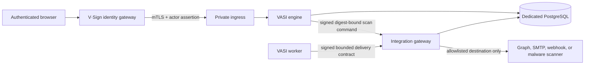

# Productized tenancy, integrations, and deployment

Status: implemented in VASI 0.11.0 and extended through VASI 0.27.0.

VASI 0.27.0 promotes company creation from the first-slice compatibility tool
to the supported internal administrator console. The gateway requires a
strict company name, normalized identifier, initial owner email, and explicit
invitation preference. The private engine commits the company, administrator
membership, owner-email grant, default profile, disabled bindings, pending
admission, and hash-chained configuration events atomically. Login invitation
delivery is a separate post-commit identity operation with an explicit
outcome; it cannot roll back or ambiguously hide a durable company. See
[Company provisioning and owner handoff](company-provisioning-and-owner-handoff.md).

VASI 0.25.0 adds immutable tenant production admission. Provisioned tenants
can prepare governed configuration while pending, but request issuance and
active outbound bindings fail closed until all eight required assurance gates
have attributable digest-bound approvals. The integration gateway revalidates
the current admission immediately before provider work. See
[Tenant production admission](tenant-production-admission.md).

VASI 0.26.0 adds an administrator-only tenant production stop. One strict,
replay-resistant command atomically makes the selected admission gate pending,
revokes every non-terminal request, suppresses queued invitation/reminder
work, appends per-assignment evidence, and records a bounded tenant
configuration-chain outcome. Completed records remain immutable and available
under their lifecycle policy.

VASI 0.19.0 extends the productized integration boundary with governed HTTPS
document malware scanning and extends encrypted tenant archives to its
immutable privacy-bounded scan attempts. The transfer-coverage test derives
tenant-owned tables from all engine migrations so later evidence or integration
tables cannot be silently omitted.

## Boundary

VASI is one product codebase. Organization names, product labels, tenant
branding, capacity, retention policy selection, adapter availability, and
outbound destinations are data—not source forks. The sanitized repository uses
example values; live installation values stay in encrypted PostgreSQL runtime
settings or revisioned engine profiles.



The engine accepts a newly entered credential only long enough to validate and
encrypt it; it never reads a stored credential back. The worker and document
engine never receive stored provider credentials. The integration gateway is
an internal container with no published port and is the only component that
decrypts stored integration credentials or opens provider sockets. It reads
only the active binding needed for one capability, rechecks its registry
manifest and current installation allowlist, performs the bounded delivery or
scan, and records an immutable attempt.

## Revisioned configuration

An installation profile has a stable installation ID and immutable revisions.
It declares:

- `self_hosted` or `saas` deployment mode;
- a dedicated engine database and gateway-only public ingress;
- product-neutral organization/product/support metadata;
- administrator-only tenant provisioning and a tenant ceiling; and
- enabled adapter IDs; exact Microsoft tenant, application, and sender
  allowlists; and exact SMTP, webhook, and malware-scanner host allowlists.

A tenant profile has immutable revisions for display identity, colors, optional
support contact, the default retention-policy name, and limits for members,
workflows, active requests, PostgreSQL artifact bytes/per-artifact size, and
active integrations. Operators control installation ceilings and tenant quota
changes; tenant owners can revision branding and policy selection.

Every configuration change appends a canonical hash-chained event. Pointer rows
select the active revision without modifying prior revisions. Request issuance
locks and checks the active profile in the same PostgreSQL transaction, then
stores its revision ID, canonical snapshot, and hash on the request. Evidence
therefore retains the exact tenant context that governed issuance even after a
later profile change. Participant requests, receipts, and notifications use
that issuance-time branding snapshot as well, so a later revision cannot alter
the historical presentation.

Tenant admission uses the same immutable-revision and optimistic-pointer
pattern but is administrator-only. New and migrated tenants begin pending. The
aggregate state is derived from the exact required gate set; clients cannot
assert it. A request binds the current admitted revision and hash beside the
tenant profile, and PostgreSQL independently rejects an admission-unaware or
stale insert.

Capacity checks are enforcement, not dashboard estimates. Member grants,
workflow creation, request issuance, integration activation, and document
allocation fail atomically before their configured limit is exceeded. The
owner dashboard reports counts from the same queries and active revision.

## Integration contract

The version 1 delivery contract permits only a tenant ID, outbox job/attempt,
idempotency key, capability, and normalized notification fields. It rejects
unknown fields, credentials, unsupported event types, oversized content, and
non-opaque participant paths. The worker signs the canonical body with a
separate service HMAC and never sees a binding credential.

Bindings are tenant/capability-specific immutable revisions. Configuration is
validated before encryption; credentials use AES-256-GCM in PostgreSQL and are
redacted from every list response. Microsoft Graph, SMTP, and webhook adapters
implement the same normalized result contract. The Graph adapter accepts only
UUID tenant/application identifiers and an exact sender email already approved
in the active installation revision. It acquires app-only tokens from the fixed
Microsoft identity endpoint, caches them only in integration-gateway memory,
sends only through the fixed Graph endpoint, and records no token or provider
response body. Webhooks additionally sign the canonical provider payload and
carry the stable idempotency key. Worker retry attempts keep that key, use
bounded exponential delay, and create distinct immutable gateway and outbox
attempt records.

The separate `vasi-artifact-scan/v1` contract permits only tenant/artifact IDs,
byte length, media type, unique scan request ID, capability, schema, and exact
SHA-256 digest. It rejects filenames, bytes, credentials, and extension fields.
When `document.malware_scan` is active, the engine signs that command to the
integration gateway; the gateway revalidates the binding and exact installation
host, independently streams ordered PostgreSQL chunks to the HTTPS scanner,
and accepts only a fixed bounded verdict that repeats the same digest. The
attempt record retains bounded adapter/verdict/error provenance but no bytes,
filename, credential, outbound body, or raw response. Scan-request replay is
idempotent, while changed reuse conflicts. Tenant owners can retry an unavailable
scan against the same quarantined bytes or activate the scanner kill switch.

Version 0.11.0 performs a one-time compatibility conversion when a pre-0.11
global SMTP or webhook setting exists: the destination is placed in the first
installation allowlist and existing tenants receive an equivalent encrypted
binding. New tenants start disabled. After verification, operators should
remove the deprecated global notification settings through the settings tool.

## Deployment profiles

[`self-hosted.json`](../../config/deployment-profiles/self-hosted.json) and
[`saas.json`](../../config/deployment-profiles/saas.json) are sanitized schema
fixtures, not secret-bearing deployment files. Validate/render one with:

```bash
npm run deployment:profile -- self-hosted
npm run deployment:profile -- saas
```

Both preserve a dedicated engine database and gateway-only public ingress.
Neither enables an outbound host, Graph identity, or sender by default.
Customer origins, credentials,
certificates, signing material, branding, and addresses must be entered through
the settings/profile controls and must never be committed.

## Backup, restore, and tenant transfer

A recoverable installation requires a matched PostgreSQL dump and its exact
`data/VASI.settings`; either half alone is insufficient. `npm run backup --
create DIRECTORY` writes both at mode `0600`, adds SHA-256 checksums, and passes
the PostgreSQL password to `pg_dump` through a randomly named mode-`0600` file
inside the maintenance process's temporary filesystem. The file is removed in
a `finally` block; the password never appears in arguments or environment
values. `verify` checks files and the PostgreSQL custom archive. `restore` is deliberately destructive and requires the literal
`--confirm-replace-database` argument. PostgreSQL client tools must be installed
on the maintenance host, and the resulting directory must be stored in an
encrypted backup system.

VASI 0.15.0 also packages `scripts/backup-continuity.mjs` for recurring
operation. `create` requires an existing real mode-`0700` backup root, takes an
exclusive mode-`0600` lock, creates and verifies a timestamped matched backup,
and only then considers retention. It deletes only timestamp directories that
have a supported matched-backup manifest and pass checksum plus PostgreSQL
archive verification; an unrecognized or corrupt old candidate stops pruning.
The default policy retains 14 managed copies. `check` is read-only, fully
verifies the newest managed copy, and exits nonzero when it is absent, corrupt,
future-dated, or older than the default 26-hour threshold. Its JSON contains
only status, age, creation time, thresholds, counts, and bounded reason codes.

VASI 0.16.0 packages `scripts/probe-deployment-readiness.mjs` in the same
hardened maintenance images. It reads only the selected gateway or engine
settings scope, checks public health/version and trusted TLS, parses public
service-certificate material, and measures an explicitly mounted filesystem.
The command outputs no origin, path, certificate identity/material, setting,
credential, topology, installation identity, or customer data. Scheduling and
alert transport remain installation-owned.

For recovery onto a replacement PostgreSQL endpoint, first restore with a
temporary destination bootstrap. Then replace that temporary file with a copy
of the matched backup's `VASI.settings` and stream the new `databaseURL`,
`databaseSSL`, and `databasePoolMax` JSON fields to:

```bash
docker compose -f compose.engine.yaml --profile tools run --rm -T settings \
  rebind-database - --confirm-recovery-endpoint
docker compose -f compose.engine.yaml --profile tools run --rm -T settings validate
```

The rebind command proves the restored database contains the matching
installation/scope and can authenticate its encrypted required settings before
it atomically changes only the SQLite endpoint fields. It preserves the
installation ID and settings key, writes no value to output, and appends a
value-free PostgreSQL audit event. Stream the JSON from an approved secret
manager or protected descriptor; never place a credentialed database URL in
arguments, shell history, an environment file, or the repository.

The `maintenance` Compose service packages the required PostgreSQL client. It
has no destination volume by default; the operator must explicitly mount an
encrypted backup or transfer location for each run and make it writable by the
non-root maintenance user (UID `1000` by default).
Both gateway and private-engine production contracts provide this same
maintenance boundary. Neither attaches backup storage by default or selects a
scheduler, encryption provider, remote destination, retention law, RPO, or RTO.
See the backup-continuity decision for scheduler-safe commands and failure
handling.

Tenant transfer is a separate, passphrase-authenticated streaming archive:

```bash
npm run tenant:transfer -- export TENANT_ID /secure/transfers/tenant
npm run tenant:transfer -- import /secure/transfers/tenant owner@example.com
```

Interactive use reads the passphrase without echo. Automation may add
`--passphrase-file /run/secrets/tenant-transfer`; that file must be mounted
read-only, mode `0600` or stricter, and removed according to the operator's key
custody procedure after the archive is verified.

Each table stream has an independent AES-256-GCM key/tag and ciphertext hash;
the manifest has a keyed authentication code and contains no tenant name or
credentials. Import requires compatible forward migrations and an initialized
adapter registry. Integration credentials are decrypted only inside the outer
encrypted export and re-encrypted with the destination installation key.
Historical principal and actor IDs remain unchanged; import adds a new owner
email grant instead of rewriting evidence. Immutable document scan attempts are
transferred after their artifact and binding revisions and revalidated by the
same static tenant-table coverage gate.

Transfer fails closed while the tenant has pending/running outbox work or a
participant data-request scope. Those cross-tenant/privacy workflows must be
completed or expired first. A destination tenant ID or slug collision also
stops import. Run the full engine probes, evidence verification, and a matched
backup before and after transfer.

## Assurance limits

Application separation does not by itself prove network egress filtering or
database least privilege. Production deployments should add platform firewall
rules so only the integration gateway can reach approved external endpoints
and should use separately permissioned database roles when the platform can
enforce them. Graph and SMTP delivery remain at-least-once; webhook consumers
should enforce the idempotency key. Productization does not replace
legal/privacy approval,
independent penetration testing, KMS/HSM/TSA evaluation, malware-scanner
selection/definition/availability policy, or disaster-recovery exercises.
