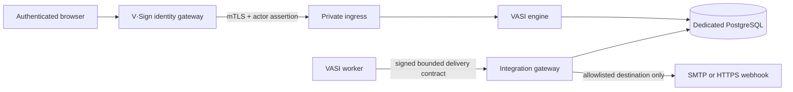

# Productized tenancy, integrations, and deployment

Status: implemented in VASI 0.11.0.

## Boundary

VASI is one product codebase. Organization names, product labels, tenant
branding, capacity, retention policy selection, adapter availability, and
outbound destinations are data—not source forks. The sanitized repository uses
example values; live installation values stay in encrypted PostgreSQL runtime
settings or revisioned engine profiles.



The engine accepts a newly entered credential only long enough to validate and
encrypt it; it never reads a stored credential back. The worker never receives
provider credentials. The integration gateway is an internal container with no
published port and is the only component that decrypts stored integration
credentials. It reads only the active binding needed for one capability,
rechecks its registry manifest and current installation allowlist, performs the
bounded delivery, and records an immutable attempt.

## Revisioned configuration

An installation profile has a stable installation ID and immutable revisions.
It declares:

- `self_hosted` or `saas` deployment mode;
- a dedicated engine database and gateway-only public ingress;
- product-neutral organization/product/support metadata;
- administrator-only tenant provisioning and a tenant ceiling; and
- enabled adapter IDs plus exact SMTP and webhook host allowlists.

A tenant profile has immutable revisions for display identity, colors, optional
support contact, the default retention-policy name, and limits for members,
workflows, active requests, PostgreSQL artifact bytes/per-artifact size, and
active integrations. Operators control installation ceilings and tenant quota
changes; tenant owners can revision branding and policy selection.

Every configuration change appends a canonical hash-chained event. Pointer rows
select the active revision without modifying prior revisions. Request issuance
locks and checks the active profile in the same PostgreSQL transaction, then
stores its revision ID, canonical snapshot, and hash on the request. Evidence
therefore retains the exact tenant context that governed issuance even after a
later profile change. Participant requests, receipts, and notifications use
that issuance-time branding snapshot as well, so a later revision cannot alter
the historical presentation.

Capacity checks are enforcement, not dashboard estimates. Member grants,
workflow creation, request issuance, integration activation, and document
allocation fail atomically before their configured limit is exceeded. The
owner dashboard reports counts from the same queries and active revision.

## Integration contract

The version 1 delivery contract permits only a tenant ID, outbox job/attempt,
idempotency key, capability, and normalized notification fields. It rejects
unknown fields, credentials, unsupported event types, oversized content, and
non-opaque participant paths. The worker signs the canonical body with a
separate service HMAC and never sees a binding credential.

Bindings are tenant/capability-specific immutable revisions. Configuration is
validated before encryption; credentials use AES-256-GCM in PostgreSQL and are
redacted from every list response. SMTP and webhook adapters implement the same
normalized result contract. Webhooks additionally sign the canonical provider
payload and carry the stable idempotency key. Worker retry attempts keep that
key, use bounded exponential delay, and create distinct immutable gateway and
outbox attempt records.

Version 0.11.0 performs a one-time compatibility conversion when a pre-0.11
global SMTP or webhook setting exists: the destination is placed in the first
installation allowlist and existing tenants receive an equivalent encrypted
binding. New tenants start disabled. After verification, operators should
remove the deprecated global notification settings through the settings tool.

## Deployment profiles

[`self-hosted.json`](../../config/deployment-profiles/self-hosted.json) and
[`saas.json`](../../config/deployment-profiles/saas.json) are sanitized schema
fixtures, not secret-bearing deployment files. Validate/render one with:

```bash
npm run deployment:profile -- self-hosted
npm run deployment:profile -- saas
```

Both preserve a dedicated engine database and gateway-only public ingress.
Neither enables an outbound host by default. Customer origins, credentials,
certificates, signing material, branding, and addresses must be entered through
the settings/profile controls and must never be committed.

## Backup, restore, and tenant transfer

A recoverable installation requires a matched PostgreSQL dump and its exact
`data/VASI.settings`; either half alone is insufficient. `npm run backup --
create DIRECTORY` writes both at mode `0600`, adds SHA-256 checksums, and passes
the PostgreSQL password to `pg_dump` through a randomly named mode-`0600` file
inside the maintenance process's temporary filesystem. The file is removed in
a `finally` block; the password never appears in arguments or environment
values. `verify` checks files and the PostgreSQL custom archive. `restore` is deliberately destructive and requires the literal
`--confirm-replace-database` argument. PostgreSQL client tools must be installed
on the maintenance host, and the resulting directory must be stored in an
encrypted backup system.

The `maintenance` Compose service packages the required PostgreSQL client. It
has no destination volume by default; the operator must explicitly mount an
encrypted backup or transfer location for each run and make it writable by the
non-root maintenance user (UID `1000` by default).

Tenant transfer is a separate, passphrase-authenticated streaming archive:

```bash
npm run tenant:transfer -- export TENANT_ID /secure/transfers/tenant
npm run tenant:transfer -- import /secure/transfers/tenant owner@example.com
```

Interactive use reads the passphrase without echo. Automation may add
`--passphrase-file /run/secrets/tenant-transfer`; that file must be mounted
read-only, mode `0600` or stricter, and removed according to the operator's key
custody procedure after the archive is verified.

Each table stream has an independent AES-256-GCM key/tag and ciphertext hash;
the manifest has a keyed authentication code and contains no tenant name or
credentials. Import requires compatible forward migrations and an initialized
adapter registry. Integration credentials are decrypted only inside the outer
encrypted export and re-encrypted with the destination installation key.
Historical principal and actor IDs remain unchanged; import adds a new owner
email grant instead of rewriting evidence.

Transfer fails closed while the tenant has pending/running outbox work or a
participant data-request scope. Those cross-tenant/privacy workflows must be
completed or expired first. A destination tenant ID or slug collision also
stops import. Run the full engine probes, evidence verification, and a matched
backup before and after transfer.

## Assurance limits

Application separation does not by itself prove network egress filtering or
database least privilege. Production deployments should add platform firewall
rules so only the integration gateway can reach approved external endpoints
and should use separately permissioned database roles when the platform can
enforce them. SMTP remains at-least-once; webhook consumers should enforce the
idempotency key. Productization does not replace legal/privacy approval,
independent penetration testing, KMS/HSM/TSA evaluation, malware-scanner
selection, or disaster-recovery exercises.
