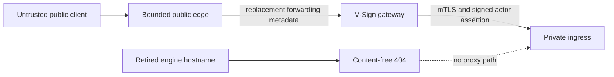

# Public ingress boundary

Status: implemented in VASI 0.39.0, continuously assured since VASI 0.40.0,
application-protocol hardened in VASI 0.43.0, and protected-route complete in
VASI 0.44.0, with adversarial authentication/request-target proof in VASI
0.46.0.

## Decision

The public reverse proxy is a security boundary, not an unreviewed transport
detail. V·Sign is the only public application origin. A retired or historical
engine hostname either has no DNS record or terminates in a content-free 404
server; it never has a `proxy_pass`, service credentials, application cookies,
or a route to private ingress.

VASI supplies a canonical Nginx reference renderer, an effective-configuration
auditor, and a black-box live probe. Nginx is the first supported edge profile,
not an application dependency: an installation can use another proxy only if
it implements and independently proves the same contract.

## Required edge behavior

The canonical Nginx profile enforces:

- one exact HTTP redirect server that names the configured canonical V·Sign
  host rather than request-derived host state, plus one exact HTTPS application
  server for that hostname;
- a 65,536-byte request-body ceiling, bounded body/header read times, bounded
  header buffers, keepalive and downstream send limits;
- per-client general and authentication request zones plus a concurrent
  connection ceiling, with generic no-store 429 responses and `Retry-After`;
- an exact pre-proxy guard that returns generic no-store 400 responses for
  encoded NUL/dot/slash/backslash path material and leading-double-slash
  request targets rather than allowing proxy/framework normalization;
- five-second connect and 30-second upstream read/send timeouts, request and
  response buffering, socket keepalive, and no automatic upstream retry;
- direct proxy directives rather than an opaque shared include;
- exact `Host`, scheme, port, and forwarding metadata; `Forwarded`, Upgrade,
  Connection, and every client-supplied forwarding chain are removed or
  replaced; and
- server-version concealment, TLS 1.2/1.3, disabled session tickets, and a
  bounded dedicated TLS session cache.

Before rendering, the gateway separately allows only GET and HEAD for page,
download, and static-resource routes. POST, PUT, PATCH, DELETE, OPTIONS, and
other methods receive an empty no-store 405 with `Allow: GET, HEAD` and no
cookie or redirect. Explicit `/api` route handlers remain responsible for
their individually reviewed methods, body parsers, origin/session checks, and
authorization. This avoids method confusion without weakening or silently
intercepting state-changing API behavior.

Every response below the Better Auth catch-all is independently wrapped with
`Cache-Control: no-store`, including successful session/provider responses,
errors, internal-host denials, and pre-parser body rejections. The wrapper
preserves the provider response status and headers, including required cookie
changes, but prevents an intermediary or browser cache from retaining session
introspection or identity-provider state.

Every exported method below the admin, owner, workspace, evidence, and
protected request-route trees is also discovered directly from the exact
release source. The discovery parser is bounded, ignores comments and string
decoys, follows ordinary method re-exports, expands reviewed dynamic segments,
and fails on an empty namespace, ambiguous route, unsupported export, symlink,
or inventory bound. This prevents a new sensitive route from silently falling
outside the release-time live matrix.

The general rate is intentionally compatible with the release health/brand
load gate. Authentication receives its own lower per-client rate. These are
edge-abuse bounds, not tenant capacity promises or a substitute for upstream
volumetric denial-of-service protection. Installations must measure and approve
their own pilot thresholds.

## Canonical rendering

`scripts/public-ingress-config.mjs` renders only validated hostnames, a fixed
upstream identifier, a bounded host-and-port target, and safe absolute
certificate paths. It accepts no environment file and no certificate or
credential bytes. The sanitized example is
`deployment/nginx/vasi-public.conf.example`; source assurance requires it to be
byte-for-byte canonical and audit-clean.

For a fresh deployment, omit every retired-host argument and remove the former
DNS record. During controlled retirement, supply the hostname and its existing
public certificate paths so both HTTP and HTTPS terminate locally with 404.
Keeping the denial server is safer than allowing a shared default virtual host
to route the name elsewhere.

For a shared ingress, the tracked overlay Dockerfile requires an explicitly
approved local base image and replaces only `vasi.conf`. A VASI release must
not rebuild unrelated virtual hosts or certificate material from a mutable
upstream image tag. The candidate records the base and resulting image IDs,
passes `nginx -t` plus the effective audit, and retains the exact prior image
and launch contract for rollback.

## Effective configuration audit

The audit consumes `nginx -T`, not only a source template. Its bounded parser
accepts at most 4 MiB, 100,000 tokens, and 64 nesting levels. It finds the exact
host servers and rejects:

- a missing or additional host server/location;
- any proxy on the retired hostname;
- `$proxy_add_x_forwarded_for` or another non-replacement forwarding rule;
- a missing/duplicated rate or connection zone;
- body, header, connection, TLS, buffering, retry, or timeout drift;
- opaque proxy includes or extra proxy headers; and
- an unreviewed or variable upstream target.

Run `nginx -t` first so Nginx proves syntax and directive-context semantics,
then pipe the same `nginx -T` output into the VASI audit with the installation's
public host, optional retired host, and gateway upstream name.

## Live black-box proof

`scripts/probe-public-ingress.mjs` verifies TLS 1.2 and TLS 1.3 handshakes, the
exact canonical HTTP-to-HTTPS redirect, public version/identity, the complete
browser security-header policy, concealed server/application versions, hostile
cross-origin preflight denial, empty no-store page-method denials, the exact
65,536-byte body boundary, and optional retired-host denial. The deliberate
rate exercise sends only fixed Gmail recommendation requests, which require no
DNS and do not consume the application's custom-domain ledger. It requires
both accepted and generic 429 responses and verifies `Retry-After` plus
`no-store`. Version 3 additionally sends raw HTTP/1.1 requests over an
authorized TLS connection so URL normalization cannot sanitize the probe
first. It requires hostile Host values and an absolute-form attacker target to
  select no VASI content or attacker-derived redirect, requires all seven bounded
traversal/separator/NUL vectors to return 400/404 without side effects, and
proves forwarded-host non-reflection plus method-override denial. A hostile
simple-origin request to Better Auth session introspection must return only
JSON `null`, with no cookie, redirect, CORS authorization, or cacheability.

The rate exercise can briefly throttle sign-in from the probe's source address.
Run it only in an approved release window. Ordinary recurring checks should
omit that flag.

`scripts/probe-public-route-isolation.mjs` sends a deliberately malformed JSON
body to every discovered non-read method without a session. Internal admin and
owner APIs must respond before parsing with an empty, no-store 404 that varies
on Host. Participant workspace, evidence, report, artifact, and media APIs must
respond with the same exact bounded no-store authentication JSON. None may set
a cookie, redirect, authorize CORS, or disclose a runtime. The probe separately
checks that public requests for internal pages expose no protected metadata and
that unauthenticated workspace and valid-format request pages redirect only to
the canonical login origin. Protected pages intentionally retain the generic
application title until authorization so their function is not embedded in a
public 404 or redirect payload.

VASI's [recurring public-edge assurance](recurring-public-edge-assurance.md)
adds independent daily exact-image vulnerability/SBOM evidence and a
15-minute runtime check of container, rollback, listeners, effective Nginx,
public/retired behavior, and fresh image-matched evidence.

## Residual responsibility

The application cannot prove that an upstream load balancer, firewall, DNS
provider, or host administrator has not bypassed the audited edge. The gateway
origin must remain private and accept traffic only from approved edge sources.
Volumetric protection, alert delivery, TLS private-key custody, certificate
renewal, and customer-specific connection/capacity policy remain installation
controls.
