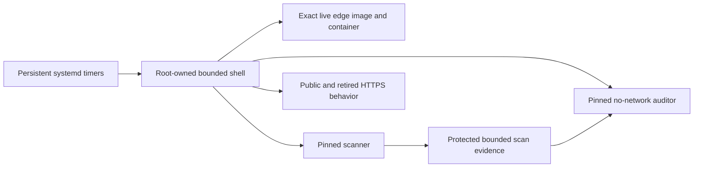

# Recurring public-edge assurance

Status: implemented in VASI 0.40.0 and corrected through VASI 0.40.2.

## Decision

Release-time ingress validation does not prove that the live edge remains
unchanged or free of newly disclosed vulnerabilities. VASI therefore ships
two independent, persistent host schedules: one scans the exact image ID used
by the live edge, and the other verifies runtime topology, effective Nginx
policy, public behavior, rollback readiness, and fresh matching scan evidence.

The edge host does not install Node. A digest-pinned copy of the same reviewed
Node base used for VASI builds runs bounded contract code in a no-network,
read-only, capability-dropped container. Trivy is independently digest-pinned.
Neither container receives the Docker socket; the trusted root-owned host
orchestrator alone uses the local Docker client.



## Protected configuration

Copy `deployment/nginx/vasi-edge-monitor.example.json` to
`/var/lib/vasi-edge/monitor.json`, replace only the installation values, and
make it `root:root` mode `0600`. The strict schema permits only:

- exact live and stopped rollback container names;
- the live image reference and required published listener ports;
- public and retired hostnames plus the audited VASI upstream name;
- protected scan and scanner-cache roots below `/var/lib/vasi-edge` and
  `/var/cache/vasi-edge`;
- a maximum evidence age no greater than seven days; and
- bounded retained scans no greater than 60.

The file contains no credential, certificate, address, customer data, or
secret. It is still protected because the combined fields describe deployment
topology. Unknown fields, unsafe paths, duplicate ports, unbounded values,
mutable tool images, symlinks, non-root ownership, or any mode other than
`0600` fail closed.

## Exact image cycle

`edge-image-assurance.sh` pulls only the two digest-pinned tools, then requires
the configured live container to be running with restart policy `always`, its
configured image reference to resolve to the exact image ID in use, and the
rollback container to be stopped with restart policy `no`. It exports that
image ID to a temporary mode-0700 directory and always deletes the image tar.

The scanner database update runs separately. Vulnerability and CycloneDX scans
then run with no network, a read-only root filesystem, all capabilities
dropped, no privilege escalation, bounded processes/CPU/memory, and no Docker
socket. The retained record contains only:

- the exact image ID;
- the installed Alpine package inventory;
- scanner version and vulnerability-database update/download times;
- Trivy JSON vulnerability evidence;
- a CycloneDX SBOM; and
- a manifest binding every artifact by byte count and SHA-256 digest.

The independent contract parses the vulnerability report itself and treats
every HIGH or CRITICAL result as blocking. It rejects unexpected, missing,
empty, oversized, symlinked, malformed, or digest-divergent artifacts. A scan,
including a failing one, is promoted atomically to `latest.json` before the
service reports its status. Only recognized timestamped directories are
eligible for bounded pruning.

## Runtime cycle

`probe-edge-runtime.sh` never pulls or updates a tool. Every run requires:

- the exact running image/reference relationship and restart policies;
- all configured Docker listener bindings and the retained stopped rollback;
- successful `nginx -t`;
- an audit-clean bounded `nginx -T` for the exact public host, retired host,
  and gateway upstream;
- certificate-verified public health with the exact release identity/version,
  no-store and required security headers, and no server version disclosure;
- a certificate-verified content-free 404 from the retired host with no cookie
  or application-runtime header; and
- a fresh passing manifest for the exact live image, byte-identical atomic
  latest state, and independently recomputed artifact digests and findings.

Effective configuration crosses the service's private temporary namespace
through a dedicated root-only `/run/vasi-edge` handoff. The Docker daemon can
read that bounded file while the service retains `PrivateTmp`; cleanup removes
the complete handoff directory after every result.

The result is aggregate JSON containing only status, listener count, artifact
count, and scan age. It contains no hostname, container, image, address, path,
package, vulnerability, certificate, or customer field.

Both cycles share a root-owned lock because runtime validation must not race
evidence promotion or retention. Legitimate overlap, including the initial
activation of both persistent timers, waits for up to four minutes. The
runtime unit's five-minute timeout remains the outer bound, so stalled work
still fails closed without reporting ordinary short contention as an outage.

## Installation and proof

Install a sanitized exact release at `/opt/vasi-edge/releases/RELEASE_ID` and
point `/opt/vasi-edge/current` to it. Then install the private configuration
and packaged units:

```bash
sudo install -d -o root -g root -m 0700 /var/lib/vasi-edge /var/cache/vasi-edge
sudo install -o root -g root -m 0600 /protected/monitor.json \
  /var/lib/vasi-edge/monitor.json
sudo install -o root -g root -m 0644 deployment/systemd/vasi-edge-* \
  /etc/systemd/system/
sudo systemctl daemon-reload
sudo systemd-analyze verify /etc/systemd/system/vasi-edge-*.service \
  /etc/systemd/system/vasi-edge-*.timer
sudo systemctl start vasi-edge-image-assurance.service
sudo systemctl start vasi-edge-runtime-readiness.service
sudo systemctl enable --now vasi-edge-image-assurance.timer \
  vasi-edge-runtime-readiness.timer
```

Do not enable the runtime timer until both manual runs pass. Confirm both
timers are enabled and active, have future triggers, and continue to point at
the current exact release. Image assurance runs daily after an initial
activation-relative delay; runtime readiness runs every 15 minutes. A
nonzero service exit must reach the installation's approved alert route.

## Limits

These controls detect reviewed edge drift; they do not prevent a trusted root
or Docker administrator from replacing both runtime and evidence. External
log anchoring, host intrusion detection, certificate renewal, volumetric
protection, independent scanning, vulnerability response ownership, and alert
delivery remain installation responsibilities. Retain the exact rollback image
and launch contract independently of the scan retention window.
