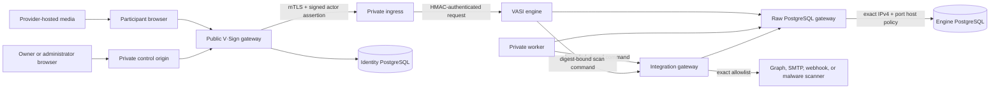

# Assurance and pilot-readiness contract

This document defines VASI's first-party security evidence, residual risks, and
the gates that must be satisfied before a bounded customer pilot. It is a
technical assurance contract, not a legal opinion, certification, independent
penetration test, or claim that an electronic act is enforceable in a particular
jurisdiction.

## Scope and trust boundaries



The gateway is the only public application surface. It authenticates people but
does not become the evidence authority. The private engine owns tenant roles,
workflow state, document bytes, event chains, evidence, retention, and reports.
The integration gateway is the only component that decrypts integration
credentials or contacts outbound notification/scanner destinations. The engine
never opens a third-party scanner socket. Provider-hosted media remains outside
VASI's authoritative storage.

Primary protected assets are:

- authentication identities, sessions, provider links, and invitation tokens;
- tenant membership, workflow definitions, participant assignments, answers,
  signatures, documents, generalized activity/media telemetry, and lifecycle
  decisions;
- evidence event chains, reports, bundles, public verification fingerprints,
  integrity seals, and signing-key history;
- PostgreSQL credentials, runtime-settings encryption keys, service TLS and
  assertion keys, tenant integration credentials, and evidence signing keys;
- operational metadata whose combination could identify a participant or
  reveal a customer's business process.

## Threat assumptions

VASI assumes that the operating system, container runtime, PostgreSQL service,
private DNS/routing, and operator accounts are administered as security
boundaries. A compromised host administrator can read process memory or replace
images and is therefore outside the application's ability to contain. VASI
does not trust browsers, identity-provider claims beyond the validated protocol
response, media-provider telemetry, email delivery, webhook consumers, public
reverse proxies with engine credentials, or tenant-supplied document content.

The product is designed to remain useful when a browser is unreliable: raw
telemetry is supporting evidence, server-side timestamps and transitions are
authoritative, and reports state their evidentiary limits. It is not designed
to prove attention, comprehension, freedom from coercion, physical identity, or
legal enforceability by itself.

## Threat register

| ID | Threat | Enforced controls and evidence | Residual risk / required owner |
|---|---|---|---|
| AUTH-1 | Account takeover, provider confusion, or manual-password downgrade | Verified provider subject/email binding; SSO-first UI; password controls hidden under Other methods; session-specific provenance; connector and session revocation; provider callback allowlists | Customer identity/MFA policy and recovery-channel security remain operator/provider responsibilities |
| AUTH-2 | Open redirect, forged origin, CSRF, or host-header confusion | Bounded same-origin return paths; configured public/private origins; origin checks on state-changing routes; Better Auth CSRF/session controls; restrictive response headers | Reverse proxy must preserve the validated host/scheme contract |
| GATE-1 | Public access to the evidence engine | Engine, worker, and integration gateway publish no host ports; only private ingress is reachable; TLS 1.3 client authentication, certificate fingerprint pinning, HMAC request authentication, one-minute EdDSA actor assertions, and persisted replay rejection | Host/network administrators remain trusted; independent network validation is required |
| TEN-1 | Cross-tenant read, write, role escalation, or quota bypass | Engine-owned roles; tenant ID derived from authorized context; transactional capacity checks; tenant isolation probes; immutable tenant profile revisions and evidence-bound snapshots | Independent adversarial tenant-isolation review remains required |
| EVID-1 | Event, response, report, bundle, or manifest tampering | Append-only hash chains, immutable database triggers, deterministic manifests/reports/bundles, Ed25519 seals, offline verification, tamper conformance, and key-history records | A host signing malicious data before sealing is not detectable solely from the seal |
| EVID-2 | Signing-key mismatch, loss, unsafe rotation, or certificate misconfiguration | Startup private/public key proof; key-ID fingerprint conflict rejection; historical public-key records; optional certificate configuration is all-or-nothing; offline verification needs no private key | Custody, backup, rotation approval, revocation, HSM/KMS, and TSA profiles require operator policy |
| ART-1 | Malicious or oversized document upload, loose-file persistence, scanner SSRF/response confusion, or parser exploit | Bounded streaming into quarantined PostgreSQL chunks; exact hashes; media-type/structure and EICAR checks; optional exact-host signed HTTPS scanner behind the isolated gateway; TLS/timeout/no-redirect/response bounds; exact digest verdict; immutable privacy-bounded attempts; clean publish, threat reject, outage quarantine/retry; no authoritative loose document | Built-in inspection remains limited; the customer must approve scanner detection quality, definition updates, availability, and source restrictions for its risk |
| MEDIA-1 | False playback/attention claim or hostile embed | Exact provider/origin descriptors; sandboxed frames; capability-specific adapters; visibility/gap/seek limits; raw telemetry and confidence statements; accessibility alternatives | Provider/browser telemetry cannot prove attention or comprehension |
| ACT-1 | False activity-presence claim, replay, or privacy-invasive browser capture | Fixed no-detail event vocabulary; no keys, input contents, coordinates, plugins, or fingerprinting signals; participant/activity/session binding; strict batch hashes, sequence and count bounds; immutable raw evidence and deterministic revisions; offline recalculation; explicit confidence limits | Browser events can be absent, automated, or spoofed and cannot prove attention or comprehension |
| OUT-1 | SSRF, credential disclosure, duplicate or obsolete delivery/scan, misleading delivery claims, or provider response leakage | Installation exact Graph tenant/application/sender and SMTP/webhook/scanner host allowlists; fixed Graph origins; encrypted revisioned credentials; isolated integration process; explicit notification purpose; terminal-state suppression; bounded owner status; provider-acceptance wording; manifest-sealed immutable attempts; strict signed contracts; redaction and idempotency | Graph and SMTP are at-least-once; an in-flight call cannot be recalled; provider acceptance does not prove inbox delivery or reading; webhook consumers must enforce idempotency; scanner service operation remains customer/provider controlled |
| NET-1 | Private process obtains general outbound access or database egress broadens | Engine and worker use internal networks; private ingress adds only a dedicated listener bridge whose host chain allows established replies and denies new flows; integration gateway alone joins provider egress; end-to-end PostgreSQL TLS crosses a minimal fixed-target raw bridge; exact IPv4/port host policies; IPv6 disabled; persistent refresh and bounded live denial/policy/listener/database proof; release checks reject network, mount, capability, marker, image, and unit drift | Host/Docker/kernel/DNS administrators remain trusted; provider destinations also depend on integration application allowlists; IPv6-only databases require a future reviewed adapter |
| CFG-1 | Secret leakage through source, environment, logs, exports, or settings tools | No environment files; mode-0600 SQLite bootstrap; AES-256-GCM PostgreSQL runtime settings; value-redacting CLI; no application secrets in container environments; tracked-source secret gate; export redaction | Host memory, database administrator, and backup custody remain trusted boundaries |
| LIFE-1 | Premature deletion, hold bypass, or privacy export overreach | Independent retention horizons; immutable policy revisions; append-only holds/releases; exact-match signed purge tombstones; data-request blockers; organization-scoped reviewed exports | The customer must approve legally appropriate retention and disclosure policy |
| SUP-1 | Vulnerable, unaccounted, or non-executable image content | Lockfile builds; complete and production npm audits; CycloneDX source and image SBOMs; pinned Trivy scanner; HIGH/CRITICAL release denial; explicit configured-user and intended-UID parse of every declared runtime command in a no-network/read-only/capability-dropped container; unknown image-role denial; minimal non-root runtime images without npm | Vulnerability data changes over time, so every release and periodic rescan are required |
| AVAIL-1 | Resource exhaustion, dependency outage, or silently stopped recurring control | Bounded payloads/chunks/batches; PostgreSQL pool limits; request timeouts; retry ceilings; health checks; read-only readiness load gate; external provider isolation; independent persistent hardened backup, capacity, deployment, operational, and egress timers; release-time scheduler contract validation | Customer-specific capacity, RTO/RPO, external alert delivery, and denial-of-service protection require measured pilot targets |
| PRIV-1 | Excess collection, fingerprinting, or misleading evidence interpretation | Purpose-limited fixed fields; unavailable values remain absent; generalized telemetry excludes interaction detail; participant context rejects plugin/font enumeration, invasive fingerprints, precise location, hardware IDs, hidden media, keys/content/coordinates, and secrets; every browser value is labeled supporting; participant history and reviewed data request; redacted public verification and participant reports | Legal/privacy owners must approve notices, lawful basis, retention, and subject-right handling |

## Repeatable release evidence

Generated evidence must be written to a new mode-0700 directory outside the
Git repository. The assurance tool removes an incomplete directory on failure
and never reads `data/`, `.private/`, or `.tasks/`.

```bash
# Source inventory, complete/production npm audit, CycloneDX SBOMs,
# tracked-secret policy, version alignment, and Compose hardening.
npm run assurance:source -- /protected/new-directory

# Each known image first proves its configured/runtime user can read and parse
# all declared runtime commands in a no-network hardened container. Exact tar exports are then
# scanned without giving the scanner a Docker socket. Vulnerability reports and
# CycloneDX image SBOMs are retained.
npm run assurance:images -- /protected/new-directory \
  vasi:VERSION vasi-settings:VERSION vasi-engine:VERSION \
  vasi-engine-tools:VERSION vasi-engine-maintenance:VERSION \
  vasi-database-gateway:VERSION

# Read-only bounded load against only health and public brand endpoints.
npm run assurance:load -- https://vsign.example.com

# Browser-rendered WCAG 2.0/2.1 A/AA automation on public unauthenticated pages.
npm run assurance:accessibility -- https://vsign.example.com --channel chrome

# Root host proof of exact database policy, four private-service denials,
# integration egress, runtime health, and PostgreSQL transport.
sudo node scripts/probe-engine-egress-boundary.mjs
```

Source assurance fails if the worktree is dirty, version declarations diverge,
private/runtime paths are tracked, secret signatures are detected, the
sanitized Compose boundary is weakened, or npm reports a HIGH/CRITICAL
vulnerability. Image assurance uses a digest-pinned scanner, creates a
temporary image tar, does not mount the Docker socket into the scanner, and
fails on an unknown image role, configured-user drift, intended-user command
read/parse failure, or any fixed or unfixed HIGH/CRITICAL finding. Runtime
smoke uses no network, a read-only root filesystem, all capabilities dropped,
and no privilege escalation. The manifest records the Git commit, image IDs,
runtime-contract result, scanner identity, policy, result summaries, and
SHA-256 of every generated artifact.

These controls are first-party release evidence. They do not replace source
review, an independent penetration test, manual assistive-technology testing,
or periodic rescans as vulnerability databases change.

## Recovery and key-lifecycle drills

A release recovery exercise uses disposable PostgreSQL endpoints and synthetic
data only:

1. Create a source installation, run migrations, and complete the full engine
   conformance sequence.
2. Create and verify a matched custom-format PostgreSQL plus `VASI.settings`
   backup. Deliberately alter each backup member and prove verification fails.
3. Restore the matched pair to the disposable recovery endpoint. When its
   endpoint differs, use the confirmed `settings rebind-database -` flow and
   `settings validate`; then run migrations and repeat record/bundle
   verification byte-for-byte.
4. Prove that a different SQLite settings key cannot authenticate restored
   runtime settings. Never work around that failure by discarding the matched
   bootstrap.
5. Export a synthetic tenant with a passphrase file, import it into an
   independently initialized database, and prove integration credentials were
   re-encrypted while their non-secret fingerprint remained stable.
6. With a disposable TLS scanner, prove exact-host denial, clean publication,
   malicious/suspicious rejection, outage and digest-mismatch quarantine,
   successful retry, replay/conflict handling, immutable privacy-bounded
   attempts, and inclusion in matched backup/restore and tenant transfer.
7. Generate a second evidence key, retain both public key records, and prove old
   and new records verify offline. Prove mismatched private/public keys,
   conflicting reused key IDs, partial certificate configuration, and altered
   seals fail closed.
8. Record measured recovery time, recovered row/fingerprint counts, image/source
   commit, and operator identity without retaining secrets or synthetic answers.

Production restores require an approved outage and rollback window. A matched
backup is unusable without its SQLite settings key; the settings file is also
insufficient without its PostgreSQL backup. They must be encrypted, retained,
and recovery-tested as a pair. RPO and RTO are deployment promises and must not
be inferred from the software defaults.

## Observability and privacy

Operational monitoring should cover public and private health, TLS certificate
expiry, backup age and verification, migration drift, queue depth and oldest
job age, failed/suppressed delivery attempts, scanner failures/threat verdicts/
retryable quarantines, purge failures, settings changes, signing-key status,
database saturation, latency/error thresholds, and disk growth. Alerts must
identify a service, tenant-safe opaque reference, event type, and correlation
ID—not an answer, signature, document content, provider token, credential,
participant path, or full email address.

VASI 0.14.0 implements the engine-owned portion as the private
`vasi-operational-snapshot/v1` contract. Only an authenticated administrator
actor can read it through private ingress. The internal console and
`npm run assurance:operations` consume the same aggregate shape: release and
migration state, queue counts/age, delivery outcomes and bounded error codes,
document-scanning outcomes/retry state, lifecycle pressure, signing-key status,
product/settings change counts,
tenant/binding counts, query latency, and connection-pool pressure. Contract
tests and the live service proof reject participant, email, request, content,
response, link, payload, recipient, and credential fields. The host probe
applies the versioned thresholds in `config/assurance-policy.json` and exits
nonzero on failure so an installation-selected scheduler can alert without
making VASI depend on a proprietary monitoring product.

VASI 0.15.0 implements the host-backup portion without moving host topology or
backup credentials into the engine. `backup-continuity.mjs create` atomically
creates and verifies a matched PostgreSQL/bootstrap copy before bounded
retention; `check` independently verifies the newest managed copy and applies
the versioned 26-hour maximum-age threshold. Missing, corrupt, malformed,
future-dated, stale, unsafe-root, and concurrent-cycle conditions fail nonzero.
The resulting JSON contains no path, database endpoint, installation ID,
credential, tenant, participant, or evidence field. The installation scheduler
must monitor both the create job and the independent freshness check.

VASI 0.16.0 implements the bounded deployment-perimeter portion through
`npm run assurance:deployment`. It verifies the exact public health version,
publicly trusted TLS validity window, expected gateway or engine
service-certificate set, and an operator-selected filesystem against the
versioned 30-day, 5-GiB-free, and 85-percent-use defaults. Unavailable,
malformed, mismatched, expiring, not-yet-valid, or capacity-pressure states
exit nonzero. The result contains no target, path, certificate identity or PEM,
setting, topology, credential, tenant, participant, or evidence field. Each
installation must schedule the gateway and engine scopes independently and
forward only the bounded result to its approved alert destination.

VASI 0.20.0 implements the host and PostgreSQL capacity portion through
`npm run assurance:capacity` and the hardened Compose `capacity` service. It
samples only aggregate Linux proc inputs, measures explicitly named empty
sentinel mounts for byte/inode pressure, and queries aggregate database size,
latency, connection use, transaction age, and replication posture. Missing,
malformed, or threshold-failing inputs exit nonzero with fixed reason codes.
Paths, endpoints, process data, SQL, credentials, and customer fields never
enter its bounded result. Each installation must schedule both host scopes and
set the optional primary-replica requirement to match its approved topology.

VASI 0.21.0 implements recurring outbound-boundary enforcement and
verification with independent systemd timers. Policy refresh renders the
protected database destination into an exact temporary host rule set without
logging it. The separate probe compares the installed chain exactly, proves
that the database gateway, engine, worker, and private ingress cannot reach a
fixed public canary, proves the integration gateway can, checks declared
runtime health, and executes a database query through the raw tunnel. Its
bounded output contains no route, address, subnet, hostname, URL, container
identity, response body, credential, or customer field. Both nonzero exits
must reach the installation's approved monitoring destination.

VASI 0.21.2 adds the private-ingress listener bridge to that recurring
contract. A second exact chain allows only established replies before terminal
new-flow denial, and the bounded probe also requires the published listener to
accept a host TCP connection. Both chains are installed and refreshed as one
host operation.

VASI 0.24.0 packages all first-party recurring controls as a single reviewed
systemd contract. Gateway and engine backup creation/checking, capacity, and
deployment-perimeter checks run on independent persistent timers; the engine
also schedules operational readiness alongside its existing egress refresh and
boundary proof. Source assurance enumerates all 22 units and rejects missing or
extra files, weakened sandbox/persistence/recurrence, environment files,
customer origins or home paths, ignored live overrides, Docker-socket mounts,
privileged mode, and host networking. Target-host `systemd-analyze verify` and
manual first runs remain mandatory. Alert delivery and named response ownership
remain installation gates.

VASI 0.25.0 turns the pilot table below into an enforced tenant control plane.
Every provisioned tenant starts pending. Administrators record one immutable,
digest-bound, attributable decision per gate; VASI derives admission only when
all eight are approved. Request issuance, active integration revisions, and
outbound gateway execution fail closed while pending. The operational snapshot
reports pending admission as attention, and manifest version 9 binds the exact
admitted revision for offline verification. These controls preserve decisions;
they do not allow VASI to self-approve independent, legal, accessibility,
custody, or customer-owner work.

VASI 0.26.0 makes the pilot stop criterion executable rather than procedural.
An installation administrator selects the accountable gate, fixed reason code,
and opaque incident reference. In one transaction VASI makes the gate pending,
revokes all scheduled/issued/in-progress requests with per-assignment chain
events, suppresses pending invitations/reminders, and appends a
replay-resistant tenant configuration event. Already completed evidence,
history, legal holds, and lifecycle policy are not rewritten. Recovery requires
a fresh approval for the selected gate and new participant requests; a stop
cannot recall a provider operation that completed before the stop obtained its
exclusive admission lock.

VASI 0.27.0 makes the initial company/owner bootstrap operationally explicit.
The private engine commits the tenant boundary and owner-email grant before the
gateway attempts identity invitation delivery. The internal console reports a
mail failure as partial success and directs the operator to retry only the
invitation, preventing duplicate tenant creation. New tenants remain pending;
this workflow does not satisfy, approve, or bypass any pilot admission row.

Health and brand endpoints are intentionally read-only and are the only targets
of the built-in load probe. Evidence, authentication, invitation, and
verification endpoints must not be load-tested in production without an
approved synthetic tenant and test window.

## Pilot admission gates

A customer pilot is admitted only when every applicable row has an identified
owner and dated evidence.

| Gate | Minimum evidence | Approval owner |
|---|---|---|
| Exact release | Clean source manifest, SBOMs, zero blocking audit/image findings, build/test/conformance results, matched verified backup | VASI release owner |
| Isolation and integrity | First-party isolation/tamper suite plus independent penetration review of public, private, and tenant boundaries | Independent security assessor |
| Identity and delivery | Approved providers, callback origins, MFA/conditional-access policy where applicable, tested auth mail, and tenant delivery adapter or documented manual-link process | Customer identity/operations owner |
| Privacy and legal | Approved notice/consent language, field inventory, data-request process, retention/hold policy, jurisdiction and electronic-act analysis | Customer privacy/legal owner |
| Accessibility | Automated gate plus keyboard, screen reader, zoom/reflow, motion, and media-alternative review | Accessibility owner or qualified reviewer |
| Malware/content | Risk classification and approved scanner adapter or explicit restriction to trusted document sources | Customer security owner |
| Recovery and custody | Successful disposable recovery drill, RPO/RTO, backup custody, key rotation/revocation, break-glass and certificate/TSA decisions | Customer operations/security owner |
| Capacity and support | Agreed concurrency/volume thresholds, load evidence, alert destinations, incident contacts, support hours, rollback/stop criteria | Pilot business and operations owners |

Until the independent, legal/privacy, and named pilot-owner gates are approved,
VASI may be demonstrated with synthetic data but must not be represented as a
certified, legally sufficient, or generally production-approved service.
