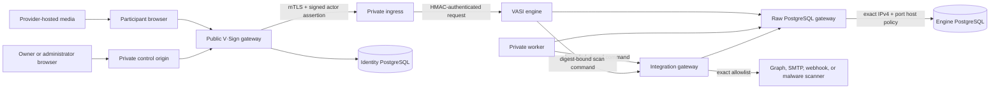

# Assurance and pilot-readiness contract

This document defines VASI's first-party security evidence, residual risks, and
the gates that must be satisfied before a bounded customer pilot. It is a
technical assurance contract, not a legal opinion, certification, independent
penetration test, or claim that an electronic act is enforceable in a particular
jurisdiction.

## Scope and trust boundaries



The gateway is the only public application surface. It authenticates people but
does not become the evidence authority. The private engine owns tenant roles,
workflow state, document bytes, event chains, evidence, retention, and reports.
The integration gateway is the only component that decrypts integration
credentials or contacts outbound notification/scanner destinations. The engine
never opens a third-party scanner socket. Provider-hosted media remains outside
VASI's authoritative storage.

Primary protected assets are:

- authentication identities, sessions, provider links, and invitation tokens;
- tenant membership, workflow definitions, participant assignments, answers,
  signatures, documents, generalized activity/media telemetry, and lifecycle
  decisions;
- evidence event chains, reports, bundles, public verification fingerprints,
  integrity seals, and signing-key history;
- PostgreSQL credentials, runtime-settings encryption keys, service TLS and
  assertion keys, tenant integration credentials, and evidence signing keys;
- operational metadata whose combination could identify a participant or
  reveal a customer's business process.

## Threat assumptions

VASI assumes that the operating system, container runtime, PostgreSQL service,
private DNS/routing, and operator accounts are administered as security
boundaries. A compromised host administrator can read process memory or replace
images and is therefore outside the application's ability to contain. VASI
does not trust browsers, identity-provider claims beyond the validated protocol
response, media-provider telemetry, email delivery, webhook consumers, public
reverse proxies with engine credentials, or tenant-supplied document content.

The product is designed to remain useful when a browser is unreliable: raw
telemetry is supporting evidence, server-side timestamps and transitions are
authoritative, and reports state their evidentiary limits. It is not designed
to prove attention, comprehension, freedom from coercion, physical identity, or
legal enforceability by itself.

## Threat register

| ID | Threat | Enforced controls and evidence | Residual risk / required owner |
|---|---|---|---|
| AUTH-1 | Account takeover, provider confusion, manual-password downgrade, partial provider activation, or privileged identity change without trustworthy history | Verified provider subject/email binding; SSO-first UI; password controls hidden under Other methods; session-specific provenance; connector and session revocation; one fail-closed provider tuple/visibility/callback contract; documented Zoho issuer allowlist; secret-free private activation readiness; command-correlated immutable administrator audit chain; atomic local outcomes; explicit provider ambiguity; internal-only verifier and independent aggregate monitor | Provider-console registration, consent, client validity, customer identity/MFA policy, and recovery-channel security remain operator/provider responsibilities; host/database owners remain trusted without external anchoring |
| AUTH-2 | Open redirect, forged origin, CSRF, host/request-target confusion, cross-origin authorization, or page-method confusion | Bounded same-origin return paths; configured public/private origins; origin checks on state-changing routes; Better Auth CSRF/session controls and mandatory no-store responses; canonical configured-host redirects and exact-host edge servers; pre-proxy encoded traversal/separator/NUL denial; effective-config audit; GET/HEAD-only page rendering and method-override resistance; restrictive browser headers; raw hostile-host/absolute-target proof, hostile simple/preflight CORS denial, and TLS 1.2/1.3 black-box proof | DNS, TLS, and any upstream load balancer must preserve the audited host/scheme contract |
| AUTH-3 | Forged forwarding headers falsify evidence context or evade an instance-local public throttle | Strict IPv4/IPv6 parsing; bounded forwarding chains; right-to-left approved-proxy walk; ambiguous-address omission; one policy for Better Auth, engine actors, administrator audit, and verification; PostgreSQL atomic counters keyed by address HMAC; IPv6 `/64` and shared unattributable buckets; storage failure denial; edge replacement of `Forwarded`, `X-Real-IP`, and the complete forwarding chain | The gateway origin must remain private and accept only approved edge sources; any upstream proxy before the audited edge must supply authenticated peer data |
| AUTH-4 | Unauthenticated provider detection is used for unbounded DNS work, cross-host exposure, or cache poisoning | Public-host and Fetch Metadata checks; bounded email/domain parsing; fixed consumer mappings without DNS; atomic per-client and installation HMAC counters; shared strict proxy provenance; same-domain coalescing; 16-active/64-queued ceiling; cancellable timeout; strict 20-record MX validation; short authoritative-negative cache; transient-failure non-caching | Upstream proxy limits and gateway DNS availability remain installation controls; MX metadata is a recommendation, never identity or mailbox proof |
| AUTH-5 | An unauthenticated caller discovers an internal gateway route, reaches route-specific parsing before authentication, receives cacheable identity/session state, or is redirected away from the canonical login origin | Source-derived inventory of every exported admin, owner, workspace, evidence, and protected-request method; malformed-body black-box calls; empty host-varying no-store 404s for internal APIs; exact no-store 401s for participant APIs; mandatory no-store Better Auth wrapper; cross-origin session-null proof; no cookie/CORS/redirect side effects; bounded protected-page disclosure and canonical-login checks; release-assurance enforcement against static protected-page metadata, direct auth-handler returns, and ungoverned denial responses | The proof covers the exact released gateway source and public origin; independent review and network controls must still confirm that no alternate origin or upstream bypass exists |
| GATE-1 | Public access to the evidence engine | Engine, worker, and integration gateway publish no host ports; only private ingress is reachable; TLS 1.3 client authentication, certificate fingerprint pinning, HMAC request authentication, one-minute EdDSA actor assertions, and persisted replay rejection; the canonical public edge exposes only V·Sign and any retained engine hostname is a no-proxy 404 proven from effective configuration and black-box behavior | Host/network/DNS administrators remain trusted; independent network validation is required |
| TEN-1 | Cross-tenant read, write, role escalation, or quota bypass | Engine-owned roles; tenant ID derived from authorized context; transactional capacity checks; tenant isolation probes; immutable tenant profile revisions and evidence-bound snapshots | Independent adversarial tenant-isolation review remains required |
| EVID-1 | Event, response, report, bundle, or manifest tampering | Append-only hash chains, immutable database triggers, deterministic manifests/reports/bundles, Ed25519 seals, offline verification, tamper conformance, and key-history records | A host signing malicious data before sealing is not detectable solely from the seal |
| EVID-2 | Signing-key mismatch, loss, unsafe rotation, or certificate misconfiguration | Startup private/public key proof; key-ID fingerprint conflict rejection; historical public-key records; optional certificate configuration is all-or-nothing; offline verification needs no private key | Custody, backup, rotation approval, revocation, HSM/KMS, and TSA profiles require operator policy |
| ART-1 | Malicious or oversized document upload, loose-file persistence, scanner SSRF/response confusion, or parser exploit | Bounded streaming into quarantined PostgreSQL chunks; exact hashes; media-type/structure and EICAR checks; optional exact-host signed HTTPS scanner behind the isolated gateway; TLS/timeout/no-redirect/response bounds; exact digest verdict; immutable privacy-bounded attempts; clean publish, threat reject, outage quarantine/retry; no authoritative loose document | Built-in inspection remains limited; the customer must approve scanner detection quality, definition updates, availability, and source restrictions for its risk |
| MEDIA-1 | False playback/attention claim or hostile embed | Exact provider/origin descriptors; sandboxed frames; capability-specific adapters; visibility/gap/seek limits; raw telemetry and confidence statements; accessibility alternatives | Provider/browser telemetry cannot prove attention or comprehension |
| ACT-1 | False activity-presence claim, replay, or privacy-invasive browser capture | Fixed no-detail event vocabulary; no keys, input contents, coordinates, plugins, or fingerprinting signals; participant/activity/session binding; strict batch hashes, sequence and count bounds; immutable raw evidence and deterministic revisions; offline recalculation; explicit confidence limits | Browser events can be absent, automated, or spoofed and cannot prove attention or comprehension |
| OUT-1 | SSRF, credential disclosure, duplicate or obsolete delivery/scan, misleading delivery claims, or provider response leakage | Installation exact Graph tenant/application/sender and SMTP/webhook/scanner host allowlists; fixed Graph origins; encrypted revisioned credentials; isolated integration process; explicit notification purpose; terminal-state suppression; bounded owner status; provider-acceptance wording; manifest-sealed immutable attempts; strict signed contracts; redaction and idempotency | Graph and SMTP are at-least-once; an in-flight call cannot be recalled; provider acceptance does not prove inbox delivery or reading; webhook consumers must enforce idempotency; scanner service operation remains customer/provider controlled |
| NET-1 | Private process obtains general outbound access or database egress broadens | Engine and worker use internal networks; private ingress adds only a dedicated listener bridge whose host chain allows established replies and denies new flows; integration gateway alone joins provider egress; end-to-end PostgreSQL TLS crosses a minimal fixed-target raw bridge; exact IPv4/port host policies; IPv6 disabled; persistent refresh and bounded live denial/policy/listener/database proof; release checks reject network, mount, capability, marker, image, and unit drift | Host/Docker/kernel/DNS administrators remain trusted; provider destinations also depend on integration application allowlists; IPv6-only databases require a future reviewed adapter |
| DEPLOY-1 | A malformed, untrusted, or mode-drifted source archive is staged, or a sanitized release is selected without protected installation state, with the wrong images or merged listener, after a partial reconciliation, or after a selected-path CLI silently did nothing | Expected archive SHA-256 and Git provenance; bounded in-process USTAR parsing; regular-file/directory-only path, size, mode, and privacy policy; private extraction; normalized ownership/modes; atomic no-replace candidate publication; mode-0600 exact activation configuration and listener-only overlay outside releases/data; canonical ownership/path/mode checks; physical symlink-safe CLI identity and exact entrypoint inventory; exact shared-data link; sanitized/merged Compose equivalence except one loopback/RFC1918 listener; exact image/hardening proof; aggregate-result dry-run; atomic selector; complete no-build health-wait reconciliation; no orphan removal; automatic prior-selector/runtime recovery; stable live-overlay link for recurring controls; adversarial and release-assurance tests | Host/Docker administrators, approved digest provenance, and protected-file custody remain trusted; backup, migration compatibility, public edge, independent monitoring, and post-cutover gates remain separate operator evidence |
| CFG-1 | Secret leakage through source, environment, logs, exports, or settings tools | No environment files; mode-0600 SQLite bootstrap; AES-256-GCM PostgreSQL runtime settings; value-redacting CLI; no application secrets in container environments; tracked-source secret gate; export redaction | Host memory, database administrator, and backup custody remain trusted boundaries |
| CUST-1 | Matched backup disclosure, copy corruption, unsafe pruning, lost recipient key, or false off-host confidence | Verified matched source; no plaintext aggregate archive; streaming fixed-size independently authenticated AES-256-GCM chunks; ephemeral X25519/HKDF and per-recipient authenticated key wraps; application stores public recipients only; whole-package copy digest; strict structure/freshness checks; verified-candidate retention; authenticated offline extraction with no partial output | Installation must prove remote transfer, geographic/organizational separation, private-key custody and recovery, deletion/legal-hold policy, restore drills, and RPO/RTO; a compromised authorized source host can create a false backup |
| LIFE-1 | Premature deletion, hold bypass, or privacy export overreach | Independent retention horizons; immutable policy revisions; append-only holds/releases; exact-match signed purge tombstones; data-request blockers; organization-scoped reviewed exports | The customer must approve legally appropriate retention and disclosure policy |
| REVIEW-1 | A readiness dossier is altered, rendered differently from its embedded facts, oversized or executable, signed by an unexpected key, or presented as externally trusted when only self-consistent | One shared strict wrapper/dossier/attestation validator and renderer; canonical SHA-256 recomputation; exact eight-gate/readiness/quota/usage/adapter binding; 2 MiB strict-UTF-8 physical-file boundary; no final symlink; exact JSON serialization and byte-for-byte HTML reproduction; mandatory VASI integrity signature for new exports; optional certificate leaf signature; exact role/key/fingerprint binding; independently pinnable dossier and integrity-key fingerprints; explicit unsigned legacy result; fixed aggregate output; adversarial and release-assurance tests | Embedded keys alone do not establish controller identity; certificate chain trust, revocation, trusted time, gate sufficiency, external evidence, audit-chain comparison, and independent approval remain reviewer responsibilities |
| SUP-1 | Vulnerable source or vulnerable, unaccounted, or non-executable image content | Exact-lock production installs omit development/optional packages and lifecycle scripts; source assurance pins that build contract; physical image inspection rejects npm/npx plus every declared-development or lock-marked development/optional path outside the role-specific reviewed `sharp` exception; complete and production npm audits; CycloneDX source and image SBOMs; commit-pinned CodeQL JavaScript/TypeScript `security-extended` analysis on pull request, `main`, and schedule with a bounded fail-closed high/critical SARIF gate; pinned Trivy scanner; HIGH/CRITICAL release denial; configured-user and intended-UID parse of every declared runtime command in a no-network/read-only/capability-dropped container; unknown image-role denial; daily exact-live-edge-image rescan with atomic digest-bound retained evidence and independent finding recount | Query coverage, vulnerability intelligence, and scanner behavior remain external inputs; installations still require response ownership, independent source review, and penetration assessment; the runtime-package exception is architecture-specific and must be reviewed when the supported image platform changes |
| AVAIL-1 | Resource exhaustion, dependency outage, or silently stopped recurring control | Pre-parser 64 KiB gateway/authentication body bounds with independent private-engine limits; bounded payloads/chunks/batches; PostgreSQL pool limits; durable public-verification and provider-detection throttling; bounded/cancellable DNS work; retry ceilings; canonical edge body/header/connection/request/upstream-time limits and no automatic retry; health checks; read-only readiness load gate; external provider isolation; independent persistent hardened backup, capacity, deployment, operational, egress, exact-edge-image, and edge-runtime timers; recurring effective-config/public/retired/scan-drift proof; root-owned bounded alert spools with non-recursive one-minute readiness and explicit acknowledgement; release-time exact scheduler contract validation | Customer-specific capacity, RTO/RPO, off-host alert delivery and host-loss detection, volumetric protection, and upstream infrastructure policy require measured pilot targets |
| PRIV-1 | Excess collection, fingerprinting, or misleading evidence interpretation | Purpose-limited fixed fields; unavailable values remain absent; generalized telemetry excludes interaction detail; participant context rejects plugin/font enumeration, invasive fingerprints, precise location, hardware IDs, hidden media, keys/content/coordinates, and secrets; every browser value is labeled supporting; participant history and reviewed data request; redacted public verification and participant reports | Legal/privacy owners must approve notices, lawful basis, retention, and subject-right handling |

## Repeatable release evidence

Generated evidence must be written to a new mode-0700 directory outside the
Git repository. The assurance tool removes an incomplete directory on failure
and never reads `data/`, `.private/`, or `.tasks/`.

```bash
# Source inventory, complete/production npm audit, CycloneDX SBOMs,
# tracked-secret policy, version alignment, and Compose hardening.
npm run assurance:source -- /protected/new-directory

# Each known image first proves its configured/runtime user, physical
# dependency-minimization contract, and declared runtime commands in a
# no-network hardened container. Exact tar exports are then scanned without
# giving the scanner a Docker socket. Vulnerability reports and CycloneDX image
# SBOMs are retained.
npm run assurance:images -- /protected/new-directory \
  vasi:VERSION vasi-settings:VERSION vasi-engine:VERSION \
  vasi-engine-tools:VERSION vasi-engine-maintenance:VERSION \
  vasi-database-gateway:VERSION

# Read-only bounded load against only health and public brand endpoints.
npm run assurance:load -- https://vsign.example.com

# Browser-rendered WCAG 2.0/2.1 A/AA automation on public unauthenticated pages.
npm run assurance:accessibility -- https://vsign.example.com --channel chrome

# Public TLS/canonical redirect/page-method/CORS/header/body/retirement proof.
# Add --exercise-rate-limit only in an approved release window.
npm run assurance:ingress -- https://vsign.example.com \
  --retired-origin https://retired-vasi.example.com

# Source-derived unauthenticated isolation proof for every sensitive gateway
# API method and protected page/request entry point.
npm run assurance:routes -- https://vsign.example.com

# On the edge host, after installing the protected strict monitor JSON, prove
# the exact live image before proving runtime/evidence readiness.
sudo npm run assurance:edge-image -- /var/lib/vasi-edge/monitor.json
sudo npm run assurance:edge-runtime -- /var/lib/vasi-edge/monitor.json

# Root host proof of exact database policy, four private-service denials,
# integration egress, runtime health, and PostgreSQL transport.
sudo node scripts/probe-engine-egress-boundary.mjs
```

Source assurance fails if the worktree is dirty, version declarations diverge,
private/runtime paths are tracked, secret signatures are detected, the
sanitized Compose boundary is weakened, or npm reports a HIGH/CRITICAL
vulnerability. Image assurance uses a digest-pinned scanner, creates a
temporary image tar, does not mount the Docker socket into the scanner, and
fails on an unknown image role, configured-user drift, prohibited physical
dependency/tool path, intended-user command read/parse failure, or any fixed or
unfixed HIGH/CRITICAL finding. The dependency candidate set is bounded and
derived from the exact package and lock manifests; path traversal, malformed
flags, oversized graphs, duplicate exceptions, and exceptions not present in
that graph fail closed. Inspection uses no network, a read-only root
filesystem, all capabilities dropped, no privilege escalation, and the
contract's intended UID. The manifest records the Git commit, image IDs,
physical dependency result, runtime-contract result, scanner identity, policy,
result summaries, and SHA-256 of every generated artifact.

The hosted CodeQL workflow separately analyzes the exact pull-request or
`main` source with commit-pinned actions and `security-extended` queries. Its
generated SARIF is uploaded under the stable JavaScript analysis identity and
then checked by VASI's bounded local verifier. Missing, malformed,
unclassified, oversized, linked, or unexpected inputs fail closed, as does any
security severity of `7.0` or higher. Output contains aggregate counts only.
Source assurance rejects drift in the workflow permissions, triggers, runner,
action pins, query suite, category, or verifier handoff.

The packaged edge timers repeat the exact-live-image scan daily and verify
runtime/evidence drift every 15 minutes. These controls are first-party
evidence. They do not replace source review, an independent penetration test,
manual assistive-technology testing, external alert delivery, or an accountable
vulnerability-response process.

## Recovery and key-lifecycle drills

A release recovery exercise uses disposable PostgreSQL endpoints and synthetic
data only:

1. Create a source installation, run migrations, and complete the full engine
   conformance sequence.
2. Create and verify a matched custom-format PostgreSQL plus `VASI.settings`
   backup. Deliberately alter each backup member and prove verification fails.
3. Generate two independently held custody recipients, configure only their
   public records, stream the matched pair into one `.vbc` package, and prove
   that either private key recovers it offline. Prove a wrong key, altered
   header/wrap/ciphertext/tag, truncation, unsafe permissions, and failed inner
   verification produce no promoted or partial recovery directory.
4. Copy the package through the approved off-host path, recompute its managed
   filename digest and structure independently, and record custody/freshness
   monitoring evidence. On the custody host, authenticate every encrypted
   chunk without creating plaintext. Do not count a package left on the source
   host as off-host custody.
5. Restore the matched pair to the disposable recovery endpoint. When its
   endpoint differs, use the confirmed `settings rebind-database -` flow and
   `settings validate`; then run migrations and repeat record/bundle
   verification byte-for-byte.
6. Prove that a different SQLite settings key cannot authenticate restored
   runtime settings. Never work around that failure by discarding the matched
   bootstrap.
7. Export a synthetic tenant with a passphrase file, import it into an
   independently initialized database, and prove integration credentials were
   re-encrypted while their non-secret fingerprint remained stable.
8. With a disposable TLS scanner, prove exact-host denial, clean publication,
   malicious/suspicious rejection, outage and digest-mismatch quarantine,
   successful retry, replay/conflict handling, immutable privacy-bounded
   attempts, and inclusion in matched backup/restore and tenant transfer.
9. Generate a second evidence key, retain both public key records, and prove old
   and new records verify offline. Prove mismatched private/public keys,
   conflicting reused key IDs, partial certificate configuration, and altered
   seals fail closed.
10. Record measured recovery time, recovered row/fingerprint counts, image/source
   commit, and operator identity without retaining secrets or synthetic answers.

Production restores require an approved outage and rollback window. A matched
backup is unusable without its SQLite settings key; the settings file is also
insufficient without its PostgreSQL backup. They must be encrypted, retained,
and recovery-tested as a pair. RPO and RTO are deployment promises and must not
be inferred from the software defaults.

## Observability and privacy

Operational monitoring should cover public and private health, TLS certificate
expiry, backup age and verification, migration drift, queue depth and oldest
job age, failed/suppressed delivery attempts, scanner failures/threat verdicts/
retryable quarantines, purge failures, settings changes, signing-key status,
database saturation, latency/error thresholds, and disk growth. Alerts must
identify a service, tenant-safe opaque reference, event type, and correlation
ID—not an answer, signature, document content, provider token, credential,
participant path, or full email address.

VASI 0.14.0 implements the engine-owned portion as the private
`vasi-operational-snapshot/v1` contract. Only an authenticated administrator
actor can read it through private ingress. The internal console and
`npm run assurance:operations` consume the same aggregate shape: release and
migration state, queue counts/age, delivery outcomes and bounded error codes,
document-scanning outcomes/retry state, lifecycle pressure, signing-key status,
product/settings change counts,
tenant/binding counts, query latency, and connection-pool pressure. Contract
tests and the live service proof reject participant, email, request, content,
response, link, payload, recipient, and credential fields. The host probe
applies the versioned thresholds in `config/assurance-policy.json` and exits
nonzero on failure. The packaged recurring scheduler and durable local handoff
keep that failure pending until explicit acknowledgement, while an
installation-selected external dispatcher can alert without making VASI depend
on a proprietary monitoring product.

VASI 0.15.0 implements the host-backup portion without moving host topology or
backup credentials into the engine. `backup-continuity.mjs create` atomically
creates and verifies a matched PostgreSQL/bootstrap copy before bounded
retention; `check` independently verifies the newest managed copy and applies
the versioned 26-hour maximum-age threshold. Missing, corrupt, malformed,
future-dated, stale, unsafe-root, and concurrent-cycle conditions fail nonzero.
The resulting JSON contains no path, database endpoint, installation ID,
credential, tenant, participant, or evidence field. The installation scheduler
must monitor both the create job and the independent freshness check.

VASI 0.16.0 implements the bounded deployment-perimeter portion through
`npm run assurance:deployment`. It verifies the exact public health version,
publicly trusted TLS validity window, expected gateway or engine
service-certificate set, and an operator-selected filesystem against the
versioned 30-day, 5-GiB-free, and 85-percent-use defaults. Unavailable,
malformed, mismatched, expiring, not-yet-valid, or capacity-pressure states
exit nonzero. The result contains no target, path, certificate identity or PEM,
setting, topology, credential, tenant, participant, or evidence field. Each
installation must schedule the gateway and engine scopes independently and
forward only the bounded result to its approved alert destination.

VASI 0.20.0 implements the host and PostgreSQL capacity portion through
`npm run assurance:capacity` and the hardened Compose `capacity` service. It
samples only aggregate Linux proc inputs, measures explicitly named empty
sentinel mounts for byte/inode pressure, and queries aggregate database size,
latency, connection use, transaction age, and replication posture. Missing,
malformed, or threshold-failing inputs exit nonzero with fixed reason codes.
Paths, endpoints, process data, SQL, credentials, and customer fields never
enter its bounded result. Each installation must schedule both host scopes and
set the optional primary-replica requirement to match its approved topology.

VASI 0.21.0 implements recurring outbound-boundary enforcement and
verification with independent systemd timers. Policy refresh renders the
protected database destination into an exact temporary host rule set without
logging it. The separate probe compares the installed chain exactly, proves
that the database gateway, engine, worker, and private ingress cannot reach a
fixed public canary, proves the integration gateway can, checks declared
runtime health, and executes a database query through the raw tunnel. Its
bounded output contains no route, address, subnet, hostname, URL, container
identity, response body, credential, or customer field. Both nonzero exits
must reach the installation's approved monitoring destination.

VASI 0.21.2 adds the private-ingress listener bridge to that recurring
contract. A second exact chain allows only established replies before terminal
new-flow denial, and the bounded probe also requires the published listener to
accept a host TCP connection. Both chains are installed and refreshed as one
host operation.

VASI 0.24.0 packages the initial first-party recurring controls as a single reviewed
systemd contract. Gateway and engine backup creation/checking, capacity, and
deployment-perimeter checks run on independent persistent timers; the engine
also schedules operational readiness alongside its existing egress refresh and
boundary proof. VASI 0.34.0 adds a separate gateway identity-operations probe
and timer, so source assurance now enumerates all 24 units and rejects missing or
extra files, weakened sandbox/persistence/recurrence, environment files,
customer origins or home paths, ignored live overrides, Docker-socket mounts,
privileged mode, and host networking. Target-host `systemd-analyze verify` and
manual first runs remain mandatory. VASI 0.42.0 expands the exact contract to
37 units and wires every monitored failure into a bounded, root-owned durable
spool with a non-recursive one-minute readiness check and explicit
acknowledgement. External delivery and named response ownership remain
installation gates.

VASI 0.40.0 expands that exact contract from 24 to 28 units with independent
public-edge image and runtime schedules. The daily control exports and scans
the exact live image without giving the pinned scanner a Docker socket, retains
bounded atomic digest-bound evidence, and fails on independently counted HIGH
or CRITICAL findings. The 15-minute control verifies the live and stopped
rollback containers, restart policy, configured listeners, Nginx syntax and
effective policy, certificate-verified public/retired behavior, and a fresh
byte-identical scan manifest for the exact live image. Its digest-pinned Node
auditor runs no-network in a hardened container, so the edge host gains no
general Node runtime. The product-owned durable handoff prevents transient
edge failures from disappearing, while external alert transport and
independent host compromise detection remain installation responsibilities.

VASI 0.41.0 makes release selection a fail-closed production boundary. The
gateway and engine activator rejects missing or loose protected configuration,
path overlap, an incorrect shared-data link, ambient Compose state, any merged
change beyond one approved private listener, unavailable exact images, or
weakened runtime hardening before changing `current` or Docker state. It uses
an atomic selector, reconciles the complete role without building or removing
orphans, verifies exact running images and health, and restores the prior
selector/runtime on candidate failure. Source assurance pins the command and
both sanitized examples; target-host dry-run, rollback readiness, and all
normal post-cutover proofs remain required.

VASI 0.41.1 narrows mixed-ownership hosts to one protected, explicitly named
release-owner UID. This permits a root-only Docker caller to validate the
deployment account's release tree without trusting every local account or
granting the release owner Docker control.

VASI 0.25.0 turns the pilot table below into an enforced tenant control plane.
Every provisioned tenant starts pending. Administrators record one immutable,
digest-bound, attributable decision per gate; VASI derives admission only when
all eight are approved. Request issuance, active integration revisions, and
outbound gateway execution fail closed while pending. The operational snapshot
reports pending admission as attention, and manifest version 9 binds the exact
admitted revision for offline verification. These controls preserve decisions;
they do not allow VASI to self-approve independent, legal, accessibility,
custody, or customer-owner work.

VASI 0.26.0 makes the pilot stop criterion executable rather than procedural.
An installation administrator selects the accountable gate, fixed reason code,
and opaque incident reference. In one transaction VASI makes the gate pending,
revokes all scheduled/issued/in-progress requests with per-assignment chain
events, suppresses pending invitations/reminders, and appends a
replay-resistant tenant configuration event. Already completed evidence,
history, legal holds, and lifecycle policy are not rewritten. Recovery requires
a fresh approval for the selected gate and new participant requests; a stop
cannot recall a provider operation that completed before the stop obtained its
exclusive admission lock.

VASI 0.27.0 makes the initial company/owner bootstrap operationally explicit.
The private engine commits the tenant boundary and owner-email grant before the
gateway attempts identity invitation delivery. The internal console reports a
mail failure as partial success and directs the operator to retry only the
invitation, preventing duplicate tenant creation. New tenants remain pending;
this workflow does not satisfy, approve, or bypass any pilot admission row.

VASI 0.28.0 removes the remaining ambiguous-response duplicate-company risk.
The browser, gateway, and engine carry a stable UUID command; the engine
serializes it and commits an immutable input/result digest with the exact
tenant result. Safe replay returns that result, while changed-input,
cross-principal, or damaged replay state fails closed. The separately committed
identity invitation uses the same command as an at-most-once delivery key and
persists a monotonic provider outcome. Because no email protocol can atomically
couple provider acceptance to the identity database, the residual crash window
is explicitly reported as `delivery_unknown` and never retried automatically.

VASI 0.29.0 preserves that command through a same-tab reload without adding a
browser plaintext-data cache. Only a strict UUID, SHA-256 normalized-form
digest, and bounded timestamp can enter per-tab session storage. Unknown,
malformed, more-than-one-minute-future, and expired records are deleted; success and definite client
rejection clear the command; ambiguous server/transport outcomes retain it.
Browser storage and digest failures remain non-authoritative and cannot weaken
the private-engine actor/input binding.

VASI 0.29.1 separates connector health from generic provider-account activity.
Only a completed session carrying the exact federated method, supported
provider, provider subject, user, and creation time can advance the live
connector observation. Migration-time account activity is retained solely as
an explicitly labeled legacy estimate; missing attribution fails toward an
unknown/error light, and health-write failure cannot deny an otherwise
completed login or manufacture a successful authentication event.

VASI 0.30.0 derives participant transaction-history summaries only after the
engine re-authorizes the stable principal or verified email. Focused and
disposable proofs cover cross-participant denial, bounded authentication fields,
truthful invitation state, exact submitted response labels, schedule and status
chronology, and the intersection of post-completion workflow access with
retention availability. Raw technical context remains available only through
the separately reviewed participant-data workflow.

VASI 0.31.0 enforces immutable workflow authentication-assurance requirements
inside the private engine after participant authorization. Disposable proofs
cover cross-participant non-disclosure, password-versus-federated denial,
authentication freshness, accepted completion, manifest v10 binding, and
independent verifier recomputation. The control records a bounded method,
provider/provenance when available, authentication time, and evaluated age; it
does not retain provider subjects in the assurance object or claim that the
identity provider required MFA. Customer MFA/conditional-access policy remains
part of the identity and delivery admission gate.

VASI 0.32.0 applies a fixed 15-minute recent-authentication gate to participant
data-request creation, reviewed-export open, and every export chunk read. The
engine evaluates it before identifier lookup and records only successful bounded
evaluations in request-created, export-opened, and completed-download chain
events. Disposable proofs cover stale and missing time, unknown-request
non-disclosure, direct chunk bypass, accepted audit shape, sealed export content,
and cross-participant isolation. Provider subjects and reusable authentication
material remain excluded.

VASI 0.33.0 moves reviewed participant-data export construction into an atomic,
retry-safe private worker transaction and makes ready, scoped denial,
preparation failure, and export expiry durable tenant-governed notification
purposes. Disposable proofs cover participant-path non-generation,
exactly-once PostgreSQL artifact creation, encrypted outbox binding, terminal
redaction, status projection, denied/no-export behavior, expiry, and hash-chain
integrity. The worker and isolated integration gateway independently reject
obsolete or substituted jobs, and the gateway holds source status stable
through provider submission. Provider acceptance remains explicitly weaker than
inbox delivery or participant receipt.

VASI 0.34.0 converts gateway identity-administration history into a serialized,
immutable SHA-256 chain and correlates each privileged mutation from start to a
truthful succeeded, failed, ambiguous, or visibly incomplete outcome. Local
database changes and terminal evidence commit together; externally committed
operations preserve uncertainty. Disposable PostgreSQL proof covers legacy
backfill, concurrent append, old-runtime inserts, deleted-user history,
duplicate-terminal and context rejection, immutability, and head-substitution
detection. The internal console recomputes the chain, while a separate
aggregate-only probe fails on exact migration drift, integrity failure, slow
reads, or stale incomplete commands without exporting identities or request
context. External log anchoring, alert delivery, and database-owner distrust
remain deployment/customer trust-profile decisions.

VASI 0.35.0 closes the product-side encrypted custody packaging gap. The
maintenance image can generate an offline X25519 recipient, configure only its
public record, stream a verified matched backup to a multi-recipient envelope
of fixed-size authenticated AES-256-GCM chunks, independently check copy integrity/structure/source age,
retain only verified managed candidates, and authenticate/extract offline with
no partial output. The package header excludes installation and customer
identity but reveals timestamps, opaque key IDs, recipient count, public
material, and approximate backup size. Actual remote custody, private-key
ownership, external scheduling/alert delivery, geographic separation, restore
approval, and RPO/RTO remain customer operations/security gates.

VASI 0.36.0 places a 65,536-byte streaming boundary before every owned gateway
JSON parser and Better Auth POST handler. Disposable tests prove exact-limit
multi-chunk acceptance, actual UTF-8 byte accounting, advertised and streamed
overflow denial, declared/actual mismatch rejection, invalid encoding and
parser redaction, public-verifier denial before private-engine contact, and
provider form-post preservation after the untrusted length header is removed.
Source assurance rejects direct `request.json()` use in tracked gateway
request-handling source. Reverse-proxy concurrency, connection, header, idle, and sustained-load
policy remains installation and pilot evidence.

VASI 0.36.2 closes the fresh-release host dependency gap for the direct engine
deployment probe. Tests cover exact manifest/lock/installed-package agreement,
unsupported Node, missing and mismatched packages, settings-runtime import
failure, physically present development/optional package rejection, bounded
redaction, and assurance rejection of lifecycle scripts or a removed systemd
preflight. Preparation uses required-production `npm ci` with engine
enforcement, development and optional omission, and lifecycle scripts disabled;
optional offline mode fails closed against a pre-provisioned cache. The
recurring service verifies the currently selected release before every
perimeter check.

Health and brand endpoints are intentionally read-only and are the only targets
of the built-in load probe. Evidence, authentication, invitation, and
verification endpoints must not be load-tested in production without an
approved synthetic tenant and test window.

VASI 0.46.1 adds a raw adversarial public-authentication boundary to the
repeatable release evidence. It proves canonical-host and absolute-form target
isolation without following redirects, rejects eight encoded/ambiguous path
forms before proxying, verifies forwarded-host non-reflection and
method-override denial, and requires hostile-origin session introspection to be
non-cacheable JSON `null` with no cookie, redirect, or CORS authorization. This
is first-party regression evidence and does not replace an independent
penetration assessment.

VASI 0.46.2 makes physical direct-execution identity release-blocking for 19
importable operational CLIs. Spawned regression tests prove exact and selected-
release symlink invocation enter the activation command, while module import
does not. The shared helper rejects missing, unrelated, malformed, looping,
NUL-containing, and oversized paths. Source assurance owns the exact CLI
inventory, rejects the vulnerable literal URL comparison and missing/duplicate
guards, and requires the minimized database-gateway image to include the
helper. Live release evidence must contain the bounded activation JSON; exit
status alone is insufficient.

VASI 0.47.0 adds offline pilot-readiness dossier verification. The gateway and
CLI share one strict schema validator and HTML renderer. The CLI accepts only a
physical regular JSON or HTML export of at most 2 MiB, recomputes canonical
VASI JSON SHA-256, optionally compares a separately supplied digest, and emits
only one fixed aggregate result. HTML verification requires the complete
wrapper embedding and byte-for-byte renderer output, so visible edits,
executable additions, duplicate embeddings, and covered-data changes fail.
Source assurance owns the package, gateway bridge, CLI, tests, command, and
reviewer documentation. This proves file consistency or digest equality—not
review sufficiency, installation audit-chain inclusion, source identity,
signature trust, or legal approval.

VASI 0.48.0 signs every new readiness export with the configured VASI
integrity key and any configured certificate key. A strict canonical
attestation binds the immutable export-event hash, capture time, dossier hash
and schema, export format and schema, and ordered public signing-key records.
The offline verifier checks every signature, recomputes the exact key
fingerprints, and accepts an independently obtained expected integrity-key
fingerprint. It preserves byte-exact 0.47.0 verification as explicitly
unsigned. Certificate verification proves only the leaf signature and key
match; chain trust, revocation, policy, trusted time, and legal identity remain
external review decisions.

## Pilot admission gates

A customer pilot is admitted only when every applicable row has an identified
owner and dated evidence.

| Gate | Minimum evidence | Approval owner |
|---|---|---|
| Exact release | Clean source manifest, SBOMs, current exact-source CodeQL evidence, zero blocking source/dependency/image findings, build/test/conformance results, matched verified backup | VASI release owner |
| Isolation and integrity | First-party isolation/tamper suite plus independent penetration review of public, private, and tenant boundaries | Independent security assessor |
| Identity and delivery | Approved providers, callback origins, MFA/conditional-access policy where applicable, tested auth mail, and tenant delivery adapter or documented manual-link process | Customer identity/operations owner |
| Privacy and legal | Approved notice/consent language, field inventory, data-request process, retention/hold policy, jurisdiction and electronic-act analysis | Customer privacy/legal owner |
| Accessibility | Automated gate plus keyboard, screen reader, zoom/reflow, motion, and media-alternative review | Accessibility owner or qualified reviewer |
| Malware/content | Risk classification and approved scanner adapter or explicit restriction to trusted document sources | Customer security owner |
| Recovery and custody | Successful disposable recovery drill, RPO/RTO, backup custody, key rotation/revocation, break-glass and certificate/TSA decisions | Customer operations/security owner |
| Capacity and support | Agreed concurrency/volume thresholds, load evidence, alert destinations, incident contacts, support hours, rollback/stop criteria | Pilot business and operations owners |

Until the independent, legal/privacy, and named pilot-owner gates are approved,
VASI may be demonstrated with synthetic data but must not be represented as a
certified, legally sufficient, or generally production-approved service.

VASI 0.50.0 adds a deterministic offline handoff for the separately controlled
files behind each row. The versioned descriptor requires the row's complete
checklist, artifact bindings, review time, and opaque scope/reviewer/evidence
references. Creation and verification require private physical files, reject
extras and unsafe links or names, recompute every SHA-256, and disclose only an
aggregate result. The manifest `packageDigest` is the gate's `evidenceDigest`.
This makes substitution and incomplete handoff detectable; it does not perform
the review, authorize the reviewer, accept an exception, or approve the gate.
See [Pilot-gate evidence packages](architecture/pilot-gate-evidence-packages.md).

VASI 0.51.0 closes the transcription gap without crossing that custody
boundary. The internal console verifies the canonical manifest, selected gate,
closed checklist, limitations, and package SHA-256 entirely in browser memory,
then fills only the existing opaque references and digest. It submits no
manifest or artifact field and discloses only aggregate counts. The browser
does not verify artifact bytes or approve a gate; accountable owners still rely
on the offline artifact verification and external review record.

VASI 0.52.0 closes the remaining manual final-review comparison. A
credential-free offline command requires one signed technically admitted
readiness dossier and exactly one canonical manifest for every gate, reuses the
existing signature/presentation and manifest validators, and compares every
reviewer reference, evidence reference, and digest. It rejects mixed scopes,
impossible review/decision/revision/capture order, extra or missing entries,
links, permissive modes, and noncanonical files. Its fixed aggregate result
states that artifact bytes were not reverified; external reviewer authority,
assessment sufficiency, trust policy, and approval remain separate.

VASI 0.53.0 closes the optional final byte-reverification gap. When the
separately controlled artifacts are present, the same offline command requires
one fixed physical directory per gate and reuses the existing per-gate
verifier to check exact inventory, ownership, modes, links, stable reads, byte
counts, and SHA-256 values across the complete set. It returns only total
artifact count/bytes and a matched state. Artifact meaning, review quality,
reviewer authority, custody history, and external approval remain outside this
integrity check.

VASI 0.54.0 makes identity-provider activation structurally fail closed. One
shared provider contract now distinguishes absent credentials from partial
tuples, requires a complete Apple credential route before visibility, and
restricts Zoho discovery to documented regional account origins. Settings
validation and authentication startup consume the same result. The private
administrator console shows secret-free readiness plus exact public/private
callbacks for all five providers. Provider registration, approval, consent,
credential validity, and an actual login remain external evidence.

VASI 0.54.1 closes a first-run-after-reboot edge-monitoring gap. The recurring
runtime unit now asks systemd to create the root-only mode-`0700`
`/run/vasi-edge` handoff before constructing its mount namespace. Release
assurance owns that exact unit contract; the probe still validates the physical
directory and removes its bounded per-run child on every outcome.

VASI 0.55.0 restores a current exact-source static-analysis gate. A
least-privileged hosted workflow analyzes JavaScript and TypeScript on every
pull request and `main` push, repeats weekly, and preserves the prior analysis
identity so stale upstream results can be closed by current evidence. All
actions are commit-pinned and the `security-extended` suite is mandatory. The
generated SARIF is uploaded before a bounded aggregate-only verifier rejects
links, unexpected files, malformed schemas, unclassified findings, and every
high or critical result. Release assurance owns the full workflow and verifier
entrypoint. The first current scan also drove descriptor-bound, no-follow,
stable-metadata reads for release activation and staging, tracked-source and
route inspection, runtime transport markers, evidence and passphrase inputs,
and the SARIF gate itself. CodeQL remains first-party evidence and does not
satisfy the independent penetration-review gate.

VASI 0.55.1 adds the repository controls needed to preserve that exact-source
evidence. GitHub's dependency-vulnerability alerts and dependency graph are
enabled, automatic security fixes remain enabled, and an active repository
ruleset with no bypass actors prevents deletion or non-fast-forward updates of
`refs/heads/main`. Ordinary fast-forward pushes remain available so the
operator's direct-to-`main` workflow is not silently changed. Existing secret
scanning and push protection remain active. Non-provider secret patterns and
secret-validity checks are accurately recorded as unavailable for this
user-owned public repository rather than claimed as controls. These settings
are verified by authenticated GitHub API readback; because they are hosted
repository state, source assurance alone cannot prove that they remain active.

## Readiness dossier handoff

VASI 0.45.0 lets an installation administrator export the current state behind
the pilot table as a readiness dossier. The engine uses one repeatable database
snapshot, binds the active installation and tenant profile hashes, complete
admission revision, privacy-bounded integration facts, capacity use, and latest
production-stop effects, then hashes the canonical dossier and appends an
immutable `tenant.readiness.exported` event. JSON and printable HTML carry the
same dossier hash. The HTML carries inert exact wrapper and dossier copies and
can be checked byte-for-byte with the framework-independent offline verifier.

```bash
# Obtain the configured fingerprint separately on the trusted engine host.
npm run readiness:trust-anchor

# Verify the exported file on the independent review system.
npm run readiness:verify -- DOSSIER_FILE
npm run readiness:verify -- DOSSIER_FILE --expected-sha256 LOWERCASE_SHA256
npm run readiness:verify -- DOSSIER_FILE \
  --expected-sha256 LOWERCASE_SHA256 \
  --expected-key-fingerprint LOWERCASE_SHA256
```

This export makes handoff to named owners traceable; it does not satisfy,
certify, or independently assess a gate. Credentials, raw integration
configuration, endpoint and allowlist values, personal contact data, incident
references, and operator identifiers are deliberately omitted. Reviewers still
need the separately controlled evidence named by each gate reference. See
[Pilot readiness dossier](architecture/pilot-readiness-dossier.md).
